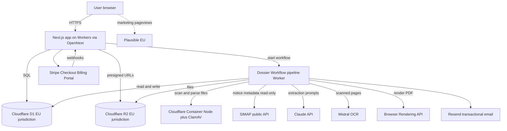
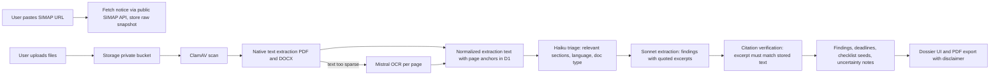

# Technical Architecture and Implementation Plan: Bidroom

## 1. Document control

| Field | Value |
| --- | --- |
| Product name | Bidroom |
| Version | v1.1 draft (Cloudflare-native revision, see `docs/adr/0002-cloudflare-native-stack.md`) |
| Status | Draft for founder review |
| Date | 2026-06-10 |
| Owner | Malik (founder) |
| Document type | Technical Architecture and Implementation Plan |
| Source documents used | Market Analysis and Business Plan (Bidroom), Product Requirements and User Stories v0.9, current vendor documentation and pricing pages researched 2026-06-10 |
| Technical decision status | Stack chosen and revised to Cloudflare-native, aligned with the founder's moola project (ADR 0002); D-01 resolved; remaining open decisions in Section 28 |
| Assumptions | Solo technical founder in Switzerland; bootstrapped; budget for infrastructure in the low hundreds of CHF per month; AI coding agents (Claude Code or similar) do most implementation; founder reviews and operates; Switzerland-first launch; English UI first |
| Open blockers | Written clarity from the SIMAP association on commercial reuse of notice data before paid launch (Section 27, R-02). Does not block pilot development with manual document upload. |

**Source hierarchy applied.** The PRD is the source of truth for product behavior. The business plan governs positioning, monetization, and constraints. Where the documents are technically impractical or risky, this plan says so explicitly and recommends an alternative.

**Pricing disclaimer.** All vendor prices in this document were verified against official pricing pages or recent secondary sources on 2026-06-10. Prices change. Re-verify before committing to annual plans. Where pricing is usage-dependent, this plan provides scenarios rather than false precision.

---

## 2. Executive summary

**What we are building.** A web application for Swiss suppliers that turns a SIMAP tender notice plus user-uploaded tender documents into a source-linked qualification brief: likely blockers, deadlines, award criteria, required evidence, an evidence checklist linked to a reusable evidence library, and a recorded bid-or-pass decision, exportable as PDF. No discovery engine, no drafting, no submission.

**Recommended architecture in one paragraph.** A single TypeScript Next.js app deployed to Cloudflare Workers via OpenNext (the same setup as the founder's moola project), plus a small pipeline Worker in the same repository. All state lives in Cloudflare with a hard EU residency guarantee: D1 (SQLite, `jurisdiction=eu`) for structured data and R2 (`jurisdiction=eu`) for files. The document analysis pipeline is a Cloudflare Workflow with durable, retryable steps: malware scan and text extraction in one Cloudflare Container (full Node runtime), OCR fallback via Mistral OCR for scanned pages, then structured extraction with citation anchors via the Claude API. PDF exports render through the Browser Rendering API. Stripe handles billing, Resend handles transactional email, Plausible handles marketing analytics, and product analytics are plain event rows in our own D1. There are no servers to operate, no Kubernetes, no Redis, and no separate search cluster.

**Recommended tech stack in one paragraph.** TypeScript end to end, deliberately aligned with moola wherever Bidroom does not need more. Next.js (App Router) with React, Tailwind CSS v4, and shadcn/ui for the frontend; Zustand for the few client-state islands; a moola-style typed dictionary for i18n (English first, German next); Zod for shared validation; Drizzle ORM on D1; Cloudflare Workflows, Queues, and Cron Triggers for background work; magic-link authentication ported from moola's pattern (no passwords, signed session cookies, store interfaces); Stripe Billing with Checkout and Customer Portal; Claude API (Sonnet for extraction, Haiku for classification and triage) with Mistral OCR for scanned documents; Resend for email; Browser Rendering for PDF exports; GitHub Actions for CI; Vitest and Playwright for tests. No error-tracking SaaS at MVP (same as moola); structured allowlist logs plus the admin failure queue cover pilot debugging.

**Most important technical decisions.**
1. Manual document upload is the only document intake in MVP. Notice metadata comes from the public read-only SIMAP API, displayed unmodified with the required disclaimer. No stored SIMAP credentials, no scraping, no document mirroring.
2. Citations are a first-class data structure, not a UI feature. Every finding stores document ID, page or paragraph anchor, and the verbatim source excerpt. The extraction pipeline is built around producing and verifying these anchors.
3. Everything runs on Cloudflare, the platform the founder already operates moola on. State lives only in D1 and R2, both created with `jurisdiction=eu` for a guaranteed EU residency story. There is no server to maintain; the whole system redeploys from the Git repository with wrangler.
4. The job pipeline is a Cloudflare Workflow (durable steps, built-in retries), with one Container for heavy parsing and malware scanning. No queue broker or worker fleet to operate.
5. LLM cost is controlled structurally: per-plan dossier limits, prompt caching, Haiku-first triage, and page caps, because per-dossier LLM cost is the main variable-cost risk (Section 9).

**Main risks.** Extraction accuracy on messy multilingual tender documents (trust risk, the single biggest product risk); SIMAP reuse terms requiring written agreement for some forms of content reuse; LLM cost per dossier exceeding the business plan's CHF 15 per customer per month assumption for heavy users; solo-founder operational load.

**Main cost drivers.** Claude API tokens and Mistral OCR pages (variable, usage-driven), then Stripe fees (2.9% plus CHF 0.30 per domestic card transaction), the Workers Paid plan (USD 5 per month, includes Containers and Workflows), and small usage-based costs for D1, R2, Browser Rendering, email, analytics, and domain. Realistic MVP infrastructure cost is CHF 10 to 50 per month; paid launch CHF 40 to 150 per month. This sits comfortably inside the business plan's CHF 200 to 800 envelope.

**What must be built first.** The dossier pipeline: SIMAP URL intake, file upload, extraction with citations, qualification brief UI with a citation viewer, and the checklist. That is the wow moment and the trust proof. Everything else (billing, reminders, team features) is sequenced after it.

**What should not be built yet.** Automated SIMAP monitoring and matching, addenda auto-diff, drafting, any SIMAP credential automation, consultant mode, SSO, mobile, multi-region infrastructure, vector search, and any second data source.

**Honest verdict on feasibility.** Feasible for a solo founder with AI coding agents in roughly 3 to 4 months of focused part-time work to a pilot-ready MVP, provided the founder runs the concierge validation in parallel and resists scope drift. The hard part is not the web app; it is extraction quality and the human-review loop around it. Budget at least a third of total effort for the extraction pipeline, its evaluation set, and the correction tooling.

---

## 3. Product and business context

**Core product workflow (from the PRD).** Sign up, create workspace, set a minimal company profile, paste a SIMAP notice URL, upload the tender documents already obtained from SIMAP, wait minutes, then review a structured qualification brief where every material finding cites its source. Confirm or dismiss findings, work the generated checklist, attach evidence from a reusable library, record Bid, Pass, or Hold with rationale, export a PDF brief. Re-upload changed documents to produce a new analysis version.

**Core value proposition.** Faster, defensible bid-or-pass decisions, fewer missed disqualifiers, and less repeated evidence assembly. Trust comes from source linking, visible uncertainty, and a strict separation between official SIMAP data and Bidroom analysis.

**Target users.** Swiss IT, cloud, cybersecurity, and data consultancies with 5 to 100 employees that bid repeatedly on SIMAP and have no dedicated bid team. One to five users per workspace.

**Monetization.** 14-day free trial without card, then subscription: Solo around CHF 69 per month, Team around CHF 169 per month, Enterprise custom and later. Stripe card payments first, invoicing later. Entitlement limits per plan (active dossiers, users, evidence items).

**Launch strategy implications.** Founder-led outbound and concierge pilots before self-serve. Technically this means: the founder needs an internal correction console early (to fix extraction errors during pilots), billing can land after the core works, and the system must work well at very small scale rather than at scale.

**Privacy and trust implications.** Evidence files contain CVs, certifications, insurance documents, and signatures, which are personal data under the Swiss FADP (in force since 1 September 2023). Tender strategy data is commercially sensitive. Requirements that follow: CH or EU hosting, encryption in transit and at rest, role-based access, metadata-first admin tooling with logged break-glass access, no model training on customer documents (the Claude API does not train on customer content by default per [Anthropic's commercial terms](https://www.anthropic.com/legal/commercial-terms); this must still be stated in Bidroom's own policy and DPA), export and deletion flows, and a public subprocessor list.

**Regulatory and legal implications.** SIMAP's general terms state that reproduction, publishing, or linking of platform content requires the Association's prior written agreement subject to exceptions, and the API terms require commercial reusers to display the statement that SIMAP data are authoritative and that Bidroom output is not an official publication ([SIMAP legal](https://www.simap.ch/en/about/legal)). The product must not give legal advice, must not submit bids, and must never include collusion-adjacent features (competitor price recommendations are prohibited by PRD LEG-005). The architecture therefore renders SIMAP source fields read-only and unmodified, bakes the disclaimer into UI and PDF templates as non-removable components, and keeps no feature surface that touches pricing intelligence.

**Scope constraints.** SIMAP-only. PDF and DOCX analyzed; everything else stored but explicitly flagged unsupported. English UI first; DE, FR, IT, EN source documents accepted. No mobile app. No public tender directory.

**Expected usage pattern.** Low traffic, bursty compute. Tens of workspaces in year one, a few dossiers per workspace per month, each dossier triggering minutes of pipeline work. Concurrency requirements are trivial; per-job document processing is the only real load. This argues strongly against serverless function architectures with short timeouts and for a plain long-running worker.

**Expected data sensitivity.** High for uploaded files (personal data plus commercial strategy), medium for findings and decisions, low for public notice metadata. This drives the storage, logging, and admin-access design in Sections 11 and 12.

---

## 4. Technical principles

| Principle | Meaning | Practical rule | Good example | Bad example |
| --- | --- | --- | --- | --- |
| Simplicity over cleverness | Prefer boring, well-documented technology an AI agent and a tired founder can reason about | One repo, one database, one deployable app plus one worker; no pattern introduced without a current need | A `processDossier` job that runs steps sequentially with clear states | An event-sourced saga orchestrator for a five-step pipeline |
| Low fixed cost | Monthly burn must stay near zero until revenue exists | Every recurring service needs a line in Section 9; prefer free tiers and platform-included services | Workflows and Queues included in the Workers Paid plan | A managed queue, managed search, and managed feature-flag service at MVP |
| High return on engineering effort | Spend effort where the product wins: extraction quality and trust UX | Extraction pipeline, citation viewer, and evaluation set get the deepest engineering; admin and billing stay minimal | A regression evaluation set of real tenders run before each pipeline change | Pixel-perfect marketing animations while blocker extraction is unreliable |
| Privacy by design | FADP privacy by design and by default is a product constraint, not a footnote | Document content never enters logs, analytics, or LLM training; admin sees metadata by default; deletion is a real workflow | Log entry: `file_id=..., pages=42, parser=ok` | Log entry containing extracted CV text |
| Security by default | Sensible defaults, no optional security | TLS everywhere, encrypted storage, RBAC enforced in one server-side authorization module, secrets only in environment configuration | Central `assertWorkspaceAccess()` called by every data access path | Per-route ad hoc permission checks |
| Testability | Core logic must be testable without the LLM or the network | Pipeline steps are pure functions over typed inputs; LLM calls are behind a thin interface with recorded fixtures | Citation-anchor verification tested against fixture documents | Logic only testable by running a live dossier end to end |
| Clean architecture, lightly | Separate domain logic from framework code, without ceremony | `domain/` and `services/` must not import from `app/` or React; UI components contain no business rules | Fit-rule evaluation in `domain/qualification` with unit tests | Eligibility logic inside a React component |
| Server-first | Sensitive documents and analysis live on the server; the browser is a thin client | No local-first sync, no client-side document parsing beyond previews | Server-rendered dossier pages with small client islands | Shipping extracted findings logic to the browser |
| Progressive enhancement, pragmatic | Core reading flows work without heavy client state | Use server components and forms where possible; reserve client interactivity for the citation viewer and checklist | Dossier summary readable as plain server-rendered HTML | A full client-side SPA state machine for static content |
| Accessibility | WCAG 2.1 AA on critical flows (PRD NFR-ACC-001) | Semantic HTML, labeled forms, keyboard-usable citation viewer, contrast-checked design tokens | Findings list navigable by keyboard with visible focus | Click-only hover citations |
| Documentation as part of implementation | Docs change in the same commit as behavior | PR checklist item; AI agents instructed to update docs with code | New env var added together with `.env.example` and docs update | A README describing last month's architecture |
| No premature scaling | Build for 100 workspaces, document the path to 10,000 | Scaling notes per component (Section 7), no horizontal-scale machinery now | Single worker with concurrency 2 | Autoscaling worker fleet behind a load balancer |
| Operational simplicity | One person must be able to operate, debug, and restore everything | Managed backups, one dashboard per concern, a written runbook, restore drill monthly | D1 Time Travel plus a tested restore script | Self-hosted database with hand-rolled cron backups |

---

## 5. Architecture goals and non-goals

**MVP goals.**
- A first-time pilot user completes a live dossier without founder help (PRD MVP quality bar).
- Notice-only analysis ready in under 90 seconds median; a 10-file, 50 MB dossier analyzed in under 6 minutes median (NFR-PERF-001/002), achieved through parallel per-file processing.
- Every material finding carries a verifiable citation or an explicit unsupported label.
- Data stored in CH or EU, encrypted in transit and at rest, with export and deletion working end to end.
- Founder correction console: re-run jobs, inspect failures by category, edit findings during pilots.

**Paid launch goals.**
- Stripe trial-to-paid flow with grace, cancellation, and entitlement enforcement, with no data loss across plan changes.
- Team workspaces up to 5 users with assignments and reminders.
- 99.5% monthly availability target, uptime monitoring, alerting to the founder's phone.
- Audit events for sensitive actions; documented incident response basics.

**Long-term goals (architecture must not block these).**
- Source abstraction so TED or Find a Tender can be added as a second source pack without rewriting the dossier model.
- Authenticated SIMAP document sync as an optional connector once legal posture allows.
- German UI via an i18n layer present from day one even if only English strings exist.
- Consultant multi-client mode via the existing workspace model (a consultant owns several workspaces).

**Performance goals.** Page loads under 2 seconds on the dossier screens; pipeline throughput of at least 3 concurrent dossiers without queue starvation; PDF export under 15 seconds.

**Reliability goals.** No single failed file blocks a dossier (NFR-REL-002); jobs are idempotent and retryable; daily backups with a monthly tested restore.

**Security goals.** Single enforced authorization layer; OWASP ASVS level 1 as the MVP bar; secrets never in the repository; admin document access only via logged break-glass.

**Privacy goals.** Data minimization, no document content in logs or analytics, no training on customer documents, subprocessor transparency, FADP rights workflows.

**Cost goals.** Fixed infrastructure under CHF 100 per month at MVP; variable cost per active paying customer under CHF 20 per month at the plan limits; no annual contracts before revenue.

**Maintainability goals.** One language, one repo, typed end to end, shared Zod schemas, conventional folder boundaries an AI agent can follow, ADRs for every irreversible choice.

**Solo-founder operation goals.** Under 2 hours per week of routine operations; every alert actionable; a written runbook covering deploy, rollback, restore, key rotation, and deletion requests.

**Architecture non-goals (explicitly not in v1).**

| Non-goal | Reason |
| --- | --- |
| Microservices, Kubernetes, service mesh | Massive operational cost, zero benefit at this scale |
| Automated SIMAP polling, matching, and alerting | SIMAP already offers saved-search subscriptions; PRD defers discovery; reuse terms need clarification first |
| Vector database and semantic search | Citation-anchored extraction does not need it; SQLite full-text search (FTS5) is enough later |
| Redis or external message broker | Workflows and Queues are part of the Workers platform; no broker to operate |
| Multi-region or high-availability clustering | 99.5% is reachable on managed platform services |
| SSO, SCIM, enterprise provisioning | Enterprise plan is sales-led and later |
| Native mobile apps and browser extensions | PRD lists both as distractions |
| Custom ML training or fine-tuning | Prompted frontier models plus an evaluation set are the right tool; training on customer data is prohibited anyway |
| Data warehouse and BI stack | Product analytics are a D1 table and a simple admin page |
| Public tender directory or SEO mirror of notices | Legal surface under SIMAP terms; PRD marks it out of scope |

---

## 6. Recommended architecture overview

**System shape.** A modular monolith on Cloudflare: one Next.js application (deployed to Workers via OpenNext, exactly like moola) serving the marketing site, product UI, and API routes, plus a pipeline Worker in the same repository hosting the dossier Workflow, queue consumers, and cron handlers, and one Container for heavy parsing and malware scanning. All state lives in Cloudflare with `jurisdiction=eu`: D1 for structured data, R2 for files. Third parties: Stripe, Claude API, Mistral OCR, Resend, Plausible, and the public read-only SIMAP API.

**Main components.**

| Component | Technology | Responsibility |
| --- | --- | --- |
| Web app | Next.js (App Router) on Cloudflare Workers via OpenNext; React, Tailwind v4, shadcn/ui | Marketing pages, auth screens, workspace UI, dossier UI, citation viewer, checklist, evidence library, settings, admin console |
| API layer | Next.js route handlers plus server actions, Zod-validated | Auth, dossier intake, uploads (presigned URLs), findings feedback, decisions, exports, billing webhooks, privacy requests |
| Pipeline Worker | Cloudflare Workflows, Queues, Cron Triggers (second wrangler config, same repo) | Dossier Workflow orchestration (notice fetch, extraction, OCR fallback, LLM extraction, citation verification, brief assembly), email sending, reminders, retention cleanup |
| Container | Cloudflare Container, Node image | ClamAV malware scan and PDF/DOCX parsing on full Node, invoked from Workflow steps |
| Database | Cloudflare D1 (SQLite, `jurisdiction=eu`) | All structured data, audit events, product analytics events |
| Object storage | Cloudflare R2 (`jurisdiction=eu`) | Uploaded tender documents, evidence files, generated PDF exports; private bucket, presigned URLs |
| Auth | Magic-link auth ported from moola's pattern (our code, our D1) | Magic links, signed httpOnly sessions, workspace invitations as signed single-use tokens |
| Payments | Stripe Checkout, Billing, Customer Portal, webhooks | Trial-to-paid, plan changes, grace, cancellation |
| Email | Resend | Verification, invitations, reminders, billing notices; metadata-only content |
| Analytics | Plausible (marketing site) plus internal `events` table (product) | Privacy-friendly measurement per PRD NFR-OBS-001 |
| Logs and failure triage | Structured allowlist logs (Workers Logs) plus the admin failure queue | Pipeline failure grouping by category in our own DB; no error-tracking SaaS at MVP (same as moola) |
| PDF rendering | Cloudflare Browser Rendering API | Renders the print HTML route to PDF for exports |
| AI components | Claude API (Sonnet for extraction, Haiku for triage and classification); Mistral OCR for scanned pages | Structured, citation-anchored extraction |
| Admin and support | Routes inside the same app, `support_admin` role | Account lookup, job health, entitlement overrides, break-glass access, deletion fulfillment |
| External source | SIMAP public API (read-only, unauthenticated for publication search and details, per [SIMAP FAQ](https://www.simap.ch/en/help/faq) and the open-source [simap-mcp client](https://github.com/Digilac/simap-mcp)) | Notice metadata for a pasted URL; displayed unmodified with the required disclaimer |

**Deployment model.** GitHub Actions runs the quality gate and e2e, then deploys with wrangler: the web app via `opennextjs-cloudflare deploy` (same as moola) and the pipeline Worker plus Container via `wrangler deploy` against its own config. D1 migrations apply with `wrangler d1 migrations apply` before the deploy step. Stripe, Resend, and Plausible are managed SaaS. DNS and registrar at Cloudflare.

**Local development model.** `pnpm dev` runs the Next.js app; `wrangler dev` and the OpenNext preview simulate D1, R2, Queues, and the Workflow locally (miniflare); Stripe CLI forwards webhooks; LLM calls run against recorded fixtures by default and against the live API only with an explicit env flag. Script names follow moola: `pnpm gate`, `cf:build`, `cf:preview`, `cf:deploy`, `cf-typegen`.



**Why this shape.** The v1.0 plan rejected serverless because of function timeouts and Chromium rendering; that constraint set is gone. Cloudflare Workflows run durable multi-minute pipelines with built-in retries, Containers (GA since April 2026, included in the Workers Paid plan) run full Node for parsing and ClamAV, and Browser Rendering replaces self-hosted Chromium. Choosing Cloudflare also puts both of the founder's products on one platform with one deploy story and one set of conventions, which is worth real solo-founder time. The prior Hetzner VPS plus Supabase design remains documented in Section 8 as the fallback if platform limits ever bite (ADR 0002).

---

## 7. Technology stack recommendation

| Layer | Recommendation | Why it fits | Alternatives considered | Why rejected | Cost | Operational implications | Risks | Migration path |
| --- | --- | --- | --- | --- | --- | --- | --- | --- |
| Language | TypeScript everywhere | One language for UI, API, pipeline, and shared schemas; same as moola; best AI-agent ecosystem | Python backend plus TS frontend | Two toolchains, duplicated types, more glue for a solo founder | Free | Workers runtime (workerd) plus Node in the Container | None material | n/a |
| Frontend framework | Next.js (App Router) | Server-first rendering, file routing, marketing plus app in one deploy, same framework as moola, huge documentation corpus for AI agents | Remix/React Router, SvelteKit, Vite SPA plus Fastify | All viable; Next.js has the largest ecosystem and template base; SPA splits the stack | Free | Deployed via the OpenNext Cloudflare adapter (proven in moola) | Framework churn; vendor-flavored features | Avoid Vercel-only APIs; stick to OpenNext-compatible features |
| Styling and design system | Tailwind CSS plus shadcn/ui | Formal, dense B2B UI fast; components are copied into the repo, no runtime dependency lock-in | MUI, Mantine, custom CSS | Heavier runtime or slower to a serious look | Free | None | Aesthetic sameness; mitigate with custom tokens | Components live in repo, restylable |
| State management | React Server Components plus Zustand for the few client islands (same as moola); no query library | App is mostly server-rendered reads plus forms; processing-status polling is a small hook | Redux, TanStack Query | Unneeded complexity; aligning on Zustand keeps both projects on one pattern | Free | None | None | Add TanStack Query later only if client caching needs grow |
| Validation | Zod, schemas in `src/shared` | One schema validates API input, forms, job payloads, and LLM output parsing; same library as moola | Valibot, TypeBox | Zod has the broadest ecosystem (drizzle-zod, react-hook-form resolvers) | Free | None | None | Mechanical swap if ever needed |
| Backend model | Next.js route handlers plus a pipeline Worker (Workflows, Queues, Cron) and one Container for heavy parsing | Durable multi-minute pipeline without operating servers; one repo, two wrangler configs | Separate Fastify/NestJS API; long-running VPS worker (v1.0 plan) | Extra service for no benefit; the VPS design is the documented fallback (ADR 0002) | Workers Paid USD 5 per month | Two deploy targets from one repo | Web and pipeline must share schema versions; solved by one repo and migrations-first deploys | Pipeline logic is plain functions; portable to a Node worker unchanged |
| Database | Cloudflare D1 (SQLite) created with `jurisdiction=eu` ([guaranteed EU storage and processing](https://developers.cloudflare.com/d1/configuration/data-location/)) | Same database family as moola; zero-ops, included in the Workers plan; Time Travel gives 30-day point-in-time restore | Supabase Postgres (v1.0 choice), Neon, self-hosted Postgres | Postgres adds a second vendor and dashboard for capacity Bidroom does not need; documented fallback if D1 limits bite (ADR 0002) | Included; usage-based beyond free allotment | No interactive transactions (use `batch()` and idempotent steps); 10 GB per-database cap | SQLite feature gaps vs Postgres at large scale | Standard SQLite; export and restore to any SQLite or migrate to Postgres via Drizzle |
| ORM / query layer | Drizzle ORM (SQLite dialect on D1) plus drizzle-kit migrations applied with `wrangler d1 migrations apply` | Typed SQL close to the metal, deterministic migrations AI agents handle well; justified divergence from moola's raw SQL because Bidroom has ~16 evolving entities | Raw SQL (moola pattern), Prisma, Kysely | Raw SQL does not scale to this entity count; Prisma adds an engine layer; Kysely lacks first-class migrations | Free | Migration discipline required | Younger than Prisma | Schema is plain SQL; switchable |
| Object storage | Cloudflare R2 with [`jurisdiction=eu`](https://developers.cloudflare.com/r2/reference/data-location/) (private bucket, presigned URLs) | Same vendor as everything else; jurisdiction is a guarantee, not a hint; zero egress fees | Supabase Storage (v1.0 choice), Hetzner Object Storage | Second vendor for no benefit on this stack | Usage-based, ~USD 0.015 per GB-month | Bucket policies, presigned URL TTLs | None material | S3 API compatible; move objects with rclone |
| Search | SQLite full-text (FTS5, deferred; not in MVP) | Dossier counts are tiny; list filters suffice | Meilisearch, Typesense | Premature | Free | None | None | Add FTS5 virtual tables when needed |
| Queue / background jobs | Cloudflare Workflows (dossier pipeline) plus Queues (simple async) plus Cron Triggers (scheduled) | Durable multi-step execution with built-in retries and state; included in the Workers plan; nothing to operate | pg-boss on Postgres (v1.0 choice), BullMQ plus Redis, Inngest | pg-boss needs Postgres and a persistent worker; the others add services or US vendors processing job payloads | Included; usage-based beyond allotment | Step semantics: each step idempotent, state passed explicitly | Workflows API is Cloudflare-proprietary; pipeline steps stay plain functions to keep them portable | Step functions port unchanged to any job runner |
| Authentication | Magic-link auth ported from moola's pattern: no passwords, signed httpOnly session cookies (HMAC-SHA256), store interfaces on D1, rate-limited; invitations as signed single-use tokens | Proven, founder-reviewed code pattern shared with moola; no passwords to leak or stuff; all auth data in our EU database; no per-MAU fees (founder decision, ADR 0002) | Better Auth (v1.0 choice), Clerk, Auth0 | Better Auth adds a dependency to learn and track for features the moola pattern covers; Clerk/Auth0 are US-hosted subprocessors with per-MAU pricing | Free | We own session security; mitigated by the proven pattern, the mandatory auth test suite, and rate limits | Self-managed auth requires care | Standard tables; exportable to any provider |
| Authorization | Application-level RBAC in one module (`server/authz`) | Two roles now (owner, member) plus internal `support_admin`; single enforcement point is auditable | Database-level row security | D1 has no RLS; all access already flows through one server module anyway | Free | Tests required per Section 20 | Bypass risk if agents add raw queries; lint rule restricts DB access to repositories | RLS available if ever migrated to Postgres |
| Payments | Stripe Checkout plus Billing plus Customer Portal | Fastest correct subscription implementation; CH support; [2.9% plus CHF 0.30 domestic cards, plus 1.5% international cards, plus 2% currency conversion](https://stripe.com/en-ch/pricing); Billing adds 0.7% of billing volume | Paddle (merchant of record), Lemon Squeezy | MoR fees are higher; Swiss B2B customers expect CHF card billing and later QR-bill invoicing which we handle manually | Per-transaction only | Webhook handling, test mode | Fee stack on small amounts | Entitlements are vendor-neutral in our DB |
| Email | Resend ([free 3,000 emails per month, Pro USD 20 for 50,000](https://resend.com/pricing)) | Generous free tier, clean API, React Email templates | Postmark, Brevo, SES | Postmark free tier is 100 emails; SES is operationally heavier | Free at MVP | SPF, DKIM, DMARC setup | US processor; mitigate by keeping email content to metadata (names, links, dates), disclosed as subprocessor | Mailer behind an interface |
| Analytics (marketing) | Plausible ([from USD 9 per month at 10k pageviews, EU-hosted](https://plausible.io/)) | Cookieless, EU, matches trust positioning | GA4, PostHog | GA4 conflicts with positioning; PostHog is more than needed | USD 9 per month | Script tag | None | Export and re-import |
| Analytics (product) | Internal `events` table in D1 | PRD NFR-OBS-001 requires metadata-only events; our DB is the safest place | PostHog EU | Extra subprocessor for ~12 event types | Free | Simple admin charts | DIY dashboards | Forwardable to any tool later |
| Error tracking | None at MVP (same as moola): structured allowlist logs plus the admin failure queue (WP-024) grouping pipeline failures by category in our own DB | One less US subprocessor; the failure queue is needed for pilot corrections anyway | Sentry (v1.0 choice), GlitchTip | Adds a subprocessor and scrubbing surface before it earns its keep; revisit if pilot debugging proves painful | Free | Failure-queue triage discipline | Less stack-trace convenience | Add Sentry or GlitchTip behind the existing log interface later |
| Logging | Structured JSON logs via Workers Logs (dashboard, search, short retention); allowlist logger so content never enters logs | Built into the platform, sufficient at this scale; privacy rule enforced at the logger | Axiom, Betterstack | Cost and another subprocessor | Included | Retention is short (days); failure queue holds what matters | Limited retention; acceptable | Add a collector later |
| Hosting (app) | Cloudflare Workers via OpenNext, Workers Paid plan ([USD 5 per month](https://developers.cloudflare.com/workers/platform/pricing/), includes Workflows, Queues, Containers allotments) | Same platform and deploy story as moola; no servers to patch; EU data via D1/R2 jurisdictions | Hetzner VPS plus Docker (v1.0 choice), Railway/Render, Fly.io | The VPS design is the documented fallback (ADR 0002); managed PaaS adds cost without removing the second platform | USD 5 per month plus usage | None beyond wrangler configs | Platform limits (CPU, memory, subrequests); mitigated by the Container for heavy work | OpenNext output also deploys to Node; pipeline steps are plain functions |
| CI/CD | GitHub Actions (free tier) | Standard; AI agents know it | GitLab CI | No reason to switch ecosystems | Free at this scale | Maintain one workflow file | None | n/a |
| Testing | Vitest (unit/integration), Playwright (E2E), Testing Library, axe-core for a11y checks | Fast, typed, standard | Jest, Cypress | Slower, heavier | Free | None | None | n/a |
| Documentation tooling | Markdown in `/docs`, ADRs in `/docs/adr`, README per package | Zero infrastructure, versioned with code | Notion, wiki | Drift from code | Free | Discipline | None | n/a |
| Feature flags | `flags` table in D1 plus typed accessor | PRD NFR-MNT-001 wants config without code changes; a table plus admin form suffices | LaunchDarkly, Flagsmith | Cost and overkill | Free | None | None | Swap accessor implementation |
| Internationalization | Moola's typed dictionary pattern: externalized `messages/*.json` with a lightweight typed accessor, English first, German next | Proven in moola across four locales; no library to track; retrofitting i18n is expensive so strings are externalized from day one | next-intl (v1.0 choice), hardcoded strings | A library adds API surface the dictionary pattern covers; hardcoding costs rework later | Free | Keys discipline | None | Move catalogs into next-intl later if richer features are needed |
| CMS / content | MDX files in repo for marketing and help pages | Founder is technical; no CMS needed | Sanity, Contentful | Cost, complexity | Free | None | None | Add CMS if a marketer joins |
| LLM provider | Claude API: Sonnet 4.6 (USD 3 input / 15 output per million tokens) for extraction, Haiku 4.5 (USD 1 / 5) for triage; batch API 50% discount; prompt caching for repeated system prompts ([pricing](https://platform.claude.com/docs/en/about-claude/pricing)) | Strong long-document extraction and instruction-following; no training on customer content by default under [commercial terms](https://www.anthropic.com/legal/commercial-terms) | OpenAI, Mistral Large (EU), Claude via Bedrock or Vertex EU regional endpoints | Mistral is the EU-residency fallback but weaker on complex extraction today; Bedrock/Vertex EU endpoints are the path if pilots demand EU-only inference, at more cloud setup cost | Variable; Section 9 | Disclose as subprocessor; US processing must be in the DPA | Model and price churn; abstraction layer plus eval set mitigate | Provider behind one `llm.ts` interface with golden-output tests |
| OCR | Mistral OCR 3 (USD 2 per 1,000 pages, USD 1 batch, [Mistral announcement](https://mistral.ai/news/mistral-ocr-3/)); used only when native text extraction yields too little text | EU vendor, cheap, markdown output with structure | Azure Document Intelligence, AWS Textract | 5x to 30x more expensive for our document mix | ~USD 0.002 per page | Page-count guardrails | Accuracy on poor scans; flagged as low-confidence | OCR behind one interface |
| PDF generation (exports) | Cloudflare Browser Rendering API rendering a print HTML route | One template system (React) for screen and PDF; disclaimer guaranteed identical; no Chromium to host | Playwright Chromium in a worker (v1.0 choice), react-pdf, Typst | Self-hosted Chromium needs a server; the others mean a second template language or weaker layout | Usage-based, included allotment on Workers Paid | None | Per-render limits; exports are single-page documents well within them | Swap renderer behind `exports/render.ts` |
| File parsing | `unpdf`/`pdfjs-dist` for PDF text plus layout, `mammoth` for DOCX, `file-type` for sniffing, ClamAV for malware scanning, all running inside the Cloudflare Container (full Node, no Worker memory limits) | Proven open-source parsers; the Container isolates heavy and risky work from the web tier | Commercial parsing APIs; parsing inside Workers | API cost and more third parties seeing documents; Workers' 128 MB memory is unsafe for 50 MB uploads | Container compute usage-based, included allotment | ClamAV signature updates in the image; rebuild weekly | Parser edge cases; covered by fixture corpus | Parsers behind `extraction/` interfaces; image runs anywhere Docker runs |

**Scaling paths.** Database: D1 read replication, then split read models, then migrate to Postgres via Drizzle if the 10 GB cap or SQLite semantics ever bind. Pipeline: raise Workflow concurrency and Container instance counts (platform-managed). Web: Workers scale automatically. Storage: R2 lifecycle rules. None of this is needed below several hundred active workspaces.

---

## 8. Alternatives and trade-off analysis

**Frontend framework.**

| Option | Pros | Cons | Cost | Complexity | Fit | Recommendation |
| --- | --- | --- | --- | --- | --- | --- |
| Next.js App Router | Server-first, one app for marketing and product, biggest ecosystem and AI-agent familiarity | Some App Router complexity; framework churn | Free | Medium | High | **Chosen** |
| Remix / React Router v7 | Clean data model, web-standard forms | Smaller template and component ecosystem | Free | Medium | Medium-high | No |
| SvelteKit | Lean, fast | Smaller hiring and AI-training corpus; team is TS/React-centric | Free | Medium | Medium | No |
| Vite SPA plus Fastify API | Maximum control | Two apps, SEO work for marketing pages, more glue | Free | Higher | Low-medium | No |

Decision: Next.js.

**Hosting.**

| Option | Pros | Cons | Cost per month | Complexity | Fit | Recommendation |
| --- | --- | --- | --- | --- | --- | --- |
| Cloudflare Workers via OpenNext plus Workflows, Containers, Browser Rendering | Same platform as moola (shared conventions and knowledge), no servers to operate, EU jurisdictions on D1/R2, Containers GA since April 2026 cover the heavy compute | Platform-specific APIs for Workflows/Containers; per-product limits to design around | USD 5 plus usage | Medium | High | **Chosen (ADR 0002)** |
| Hetzner VPS plus Docker Compose/Coolify (DE) | EU residency, cheap, full control over a long-running worker and Chromium | ~1 hour per month of ops; single VM SPOF; a second platform next to moola | EUR 7 to 17 | Medium | Medium-high | v1.0 choice; documented fallback if Cloudflare limits bite |
| Railway / Render, EU region | Managed deploys, less ops | Higher cost; per-service pricing; residency must be configured and verified per service | USD 20 to 60 | Low | Medium | No |
| Fly.io (fra/ams) | Good for containers, cheap small VMs | More moving parts (volumes, machines API); reliability complaints in community | USD 10 to 30 | Medium | Medium | No |

Decision: Cloudflare-native, stateless code, with D1 and R2 (both `jurisdiction=eu`) holding all state.

**Database and storage.**

| Option | Pros | Cons | Cost per month | Complexity | Fit | Recommendation |
| --- | --- | --- | --- | --- | --- | --- |
| Cloudflare D1 plus R2, both `jurisdiction=eu` | One vendor for everything; jurisdictions are residency guarantees; Time Travel PITR; zero ops; same database family as moola | SQLite semantics (no interactive transactions, 10 GB cap); fewer Postgres conveniences | Included plus usage | Low | High | **Chosen (ADR 0002)** |
| Supabase Pro (EU) | Managed Postgres plus storage plus backups in one EU-region vendor | Second vendor and dashboard next to Cloudflare; always-on compute billing | USD 25 | Low | Medium-high | v1.0 choice; documented fallback if D1 limits bite |
| Neon (EU) plus R2 | Scale-to-zero Postgres, branching | Two vendors, two DPAs | USD 0 to 25 | Medium | Medium | No |
| Self-hosted Postgres plus MinIO | Cheapest, full residency control | Founder owns backups, upgrades, and disaster recovery; worst failure mode for a solo operator | EUR ~10 | High | Low | No |

Decision: D1 and R2 created with `jurisdiction=eu`; the jurisdiction is stated explicitly in sales and privacy materials (resolves open decision D-01).

**Auth.**

| Option | Pros | Cons | Cost | Complexity | Fit | Recommendation |
| --- | --- | --- | --- | --- | --- | --- |
| Moola's auth pattern, ported (magic-link only, signed sessions, store interfaces on D1) | Proven and founder-reviewed in moola; no passwords stored (no credential stuffing surface); zero dependencies; identical security model across both products | We write and own invites/roles on top; magic-link-only UX | Free | Medium | High | **Chosen (ADR 0002, founder decision)** |
| Better Auth (self-hosted library) | Invitations, roles, and passwords built in; native D1 support | A dependency to learn and track; diverges from moola exactly where consistency matters most (security) | Free | Medium | Medium-high | v1.0 choice; revisit if auth feature needs outgrow the pattern |
| Clerk / Auth0 | Polished, fast | US subprocessors holding all user PII; per-MAU pricing; weakens the privacy pitch | USD 0 to 25 plus | Low | Low-medium | No |

Decision: port the moola pattern, with rate limiting and the auth test suite in Section 20 as the safety net. PRD US-002 explicitly allows a magic-link flow.

**Payments.**

| Option | Pros | Cons | Cost | Complexity | Fit | Recommendation |
| --- | --- | --- | --- | --- | --- | --- |
| Stripe (Checkout plus Billing plus Portal) | CH entity support, CHF billing, portal removes UI work, webhooks well documented | We remain merchant of record (Swiss VAT is our job; one country, manageable) | 2.9% plus CHF 0.30 domestic plus 0.7% Billing | Medium | High | **Chosen** |
| Paddle / Lemon Squeezy (MoR) | They handle VAT | Higher fees (~5% plus); B2B CHF invoicing less natural; payout currency friction | ~5% plus | Low | Medium | No |
| Datatrans / Swiss PSPs | Swiss-local | Far more integration work for a solo founder | Varies | High | Low | No |

Decision: Stripe. Swiss VAT note: registration becomes mandatory at CHF 100,000 global turnover; below that it is optional. Get a tax advisor's confirmation before paid launch (flagged in Section 26 legal checklist).

**Analytics.**

| Option | Pros | Cons | Cost | Fit | Recommendation |
| --- | --- | --- | --- | --- | --- |
| Plausible (marketing) plus internal events table (product) | EU, cookieless, matches trust story; product events never leave our DB | DIY product dashboards | USD 9 per month | High | **Chosen** |
| PostHog EU for everything | Funnels, session replay | Replay is a privacy hazard here; more vendor surface | Free tier then usage | Medium | No |
| GA4 | Free | Conflicts with the positioning and consent posture | Free | Low | No |

**Backend architecture.**

| Option | Pros | Cons | Fit | Recommendation |
| --- | --- | --- | --- | --- |
| App plus pipeline Worker on Cloudflare (Workflows, Container) | One repo, no servers, durable pipeline with built-in retries, heavy work isolated in the Container | Platform-specific orchestration APIs; steps kept as plain functions for portability | High | **Chosen (ADR 0002)** |
| Monolith plus long-running worker on a VPS | Full control, simple mental model | A second platform to operate next to moola; VM ops and SPOF | Medium-high | v1.0 choice; documented fallback |
| Separate API service plus SPA | Clear separation | More glue, no benefit at this size | Low-medium | No |

**Mobile versus web.** Web only. The PRD marks mobile as out of scope; the personas work at desks with large documents. Responsive layout for tablet reading is sufficient.

**Build versus buy.**

| Capability | Decision | Reasoning |
| --- | --- | --- |
| Auth | Build (moola pattern ported) | Residency, cost, and one security model across both products |
| Billing | Buy (Stripe) | Never hand-roll card handling |
| OCR | Buy (Mistral OCR) | Specialist model, trivially cheap at our volume |
| Extraction | Build on Claude API | This is the product; prompts, citation verification, and the eval set are the moat |
| PDF export | Build templates, buy rendering (Browser Rendering API) | Template control and disclaimer fidelity without hosting Chromium |
| Admin console | Build minimal in-app | Off-the-shelf admin tools want broad DB access, which violates the metadata-first rule |
| Uptime monitoring | Buy free tier (e.g. UptimeRobot or Better Stack free) | Zero effort |
| Notice metadata | Use official public SIMAP API read-only | Terms-compliant path; no scraping |

---

## 9. Cost model and infrastructure budget

**Fixed monthly costs.** Verified 2026-06-10; re-check before launch.

| Item | MVP (pilot) | Paid launch | Growth (~100 workspaces) | Source |
| --- | --- | --- | --- | --- |
| Cloudflare Workers Paid (includes Workflows, Queues, Containers, Browser Rendering allotments) | USD 5 | USD 5 | USD 5 | [Workers pricing](https://developers.cloudflare.com/workers/platform/pricing/) |
| D1, R2, Containers, Browser Rendering usage beyond allotments | USD 0 to 5 | USD 5 to 20 | USD 20 to 60 | usage-based; pipeline volume driven |
| Resend | USD 0 | USD 0 to 20 | USD 20 | [resend.com/pricing](https://resend.com/pricing) |
| Plausible | USD 0 (start after marketing site launch) | USD 9 | USD 9 to 19 | [plausible.io](https://plausible.io/) |
| Domain plus DNS | ~CHF 1 to 2 amortized | same | same | registrar |
| Stripe fixed | USD 0 (per-transaction only) | 0 | 0 | [stripe.com/en-ch/pricing](https://stripe.com/en-ch/pricing) |
| GitHub | USD 0 | 0 | 0 to 4 | github.com |
| Uptime monitoring | USD 0 | 0 | 0 to 10 | free tiers |
| **Fixed subtotal** | **~CHF 7 to 15** | **~CHF 20 to 55** | **~CHF 55 to 120** | |

**Variable AI cost per dossier.** Assumptions: a typical dossier is a notice plus 3 to 8 PDFs totaling 60 to 250 pages; roughly 500 tokens per page; pipeline makes one Haiku triage pass over everything and Sonnet extraction passes over the relevant 40 to 60% of pages, plus a verification pass; output ~10k to 25k tokens total; prompt caching covers the large shared system prompt.

| Scenario | Pages | OCR share | Token cost (Sonnet plus Haiku) | OCR cost | Total per dossier |
| --- | --- | --- | --- | --- | --- |
| Optimistic (small, clean docs) | 60 | 5% | ~USD 0.25 | ~USD 0.01 | **~USD 0.30** |
| Base | 150 | 15% | ~USD 0.80 | ~USD 0.05 | **~USD 0.90** |
| Conservative (large, scanned, re-runs) | 400 plus one re-analysis | 40% | ~USD 3.50 | ~USD 0.30 | **~USD 4.00** |

At plan limits (Solo: 20 active dossiers), a heavy Solo user could in theory generate 20 conservative dossiers in a month: ~USD 80 of AI cost against CHF 69 of revenue. This is the main unit-economics risk and it directly challenges the business plan's CHF 10 to 25 variable cost assumption. Mitigations, all in MVP scope: per-month analysis quota separate from active-dossier count (recommended: Solo 15 analyses per month, Team 50), page cap per dossier (recommended: 600 pages, excess flagged), Haiku-first relevance triage so Sonnet never reads boilerplate, prompt caching, and batch-mode OCR. With these, expected blended variable cost is CHF 3 to 10 per active customer per month at base usage, comfortably inside the business plan envelope.

**Per-customer cost summary.**

| Stage | Active paying customers | Fixed | Variable (AI, email, storage) | Total | Cost per customer |
| --- | --- | --- | --- | --- | --- |
| MVP pilots | 5 (unpaid or paid pilots) | CHF 15 | CHF 20 to 60 | CHF 35 to 75 | n/a |
| Paid launch | 10 to 20 | CHF 40 | CHF 50 to 200 | CHF 90 to 240 | CHF 6 to 15 |
| Growth | 80 to 120 | CHF 100 | CHF 300 to 900 | CHF 400 to 1,000 | CHF 4 to 9 |

**Main cost risks.** Whale users running many large scanned dossiers (mitigated by quotas); LLM price increases (mitigated by provider abstraction and the batch API); Container compute if parsing volume spikes (mitigated by page caps and active-CPU billing); Stripe fee stack on small monthly amounts (2.9% plus CHF 0.30 plus 0.7% Billing is roughly CHF 3 on a CHF 69 charge, about 4.5%; annual billing reduces the fixed-fee share).

**Free-tier dependencies.** Resend, GitHub Actions, and uptime monitoring. None is load-bearing at paid launch except Resend, which has a cheap paid step.

**Vendor lock-in.** The deliberate concentration is Cloudflare: Workflows and Containers are platform APIs, but pipeline steps are plain functions, the database is standard SQLite, and storage is S3-compatible, so the documented Hetzner plus Supabase fallback (Section 8) is a real escape path. Moderate for Stripe (webhooks and customer objects; entitlements stay vendor-neutral in our DB). Moderate for Claude (prompts are portable; the eval set makes provider swaps measurable).

**When paid plans become necessary.** Workers Paid (USD 5) from day one (Containers and Workflows require it); Plausible at marketing launch; Resend Pro only when volume forces it.

---

## 10. Core domain model

The PRD's domain objects map cleanly to a relational model. Entities below; fields are indicative, not exhaustive.

| Entity | Purpose | Main fields | Relationships | Ownership | Storage | Sensitivity | Lifecycle states | Validation highlights | Versioning |
| --- | --- | --- | --- | --- | --- | --- | --- | --- | --- |
| User | Login identity | id, email, name, locale, role hints, session_version | belongs to workspaces via membership | Individual | D1 | Medium (PII) | invited, active, suspended, deleted | unique email, verified email before workspace actions; `session_version` bumped to revoke all sessions (ADR 0003) | No |
| Workspace | Company tenant and billing unit | id, name, working_language, plan, billing_status, stripe_customer_id | has memberships, profile, dossiers, evidence, exports, events | Customer | D1 | High | trial, active, grace, canceled, deleted | name required; one owner minimum | No |
| Membership | User-workspace link with role | user_id, workspace_id, role (owner, member), invited_by | join table | Workspace | D1 | Medium | invited, active, removed | role enum; last owner cannot be removed | No |
| CompanyProfile | Qualification baseline | capability_tags[], regions[], languages[], certifications[], exclusions[] | one per workspace | Workspace | D1 | Medium | draft, active | tags from controlled vocabulary plus free text | Yes, profile_version on each save; analyses record the version used |
| TenderSourceItem | Official notice reference | simap_url, notice_id, authority, title, procedure_type, publication_date, raw_source jsonb, fetched_at | one per dossier (shared if duplicated) | System | D1 | Low-medium | imported, stale, archived | URL must match SIMAP pattern; raw_source stored verbatim, never edited (LEG-002) | fetched snapshots appended, not overwritten |
| Dossier | The tender case | workspace_id, source_item_id, title, status, current_analysis_version | has files, analyses, findings, tasks, decision, exports | Workspace | D1 | High | draft, processing, ready, needs_review, failed, archived | one active processing run at a time | via AnalysisRun |
| UploadedFile | Tender doc or evidence file | filename, mime, size, sha256, category, scan_status, parse_status, page_count | belongs to dossier or evidence item | Workspace | R2 (binary) plus D1 row | High | uploaded, scanning, processed, unsupported, failed, deleted | size cap 50 MB, type sniffed not trusted, ClamAV pass required before parsing | replaced files create new rows |
| AnalysisRun | One pipeline execution | dossier_id, version, model_ids, prompt_version, status, started_at, cost_cents, token_counts | has findings | System | D1 | Medium | queued, running, partial, complete, failed | one per re-analysis; never mutates earlier runs (PRD versioning rule) | This is the version mechanism |
| Finding | Extracted item | run_id, type (blocker, deadline, criterion, evidence_request, lot, qa_window, other), severity, statement, confidence (high, medium, low), status (open, confirmed, dismissed), citation_id | belongs to run; optional link to ChecklistTask | System, user-editable status | D1 | Medium | open, confirmed, dismissed | statement length caps; type and confidence enums; material findings require citation_id or explicit `unsupported=true` (ANA-003/005) | runs are immutable; edits create FindingFeedback rows |
| Citation | Source anchor | file_id (nullable for notice fields), locator (page, char offsets or notice field path), excerpt_text, excerpt_hash | belongs to finding | System | D1 | Medium-high (contains source excerpts) | n/a | excerpt must verify against the stored extraction text at creation (anti-hallucination check) | No |
| DeadlineEvent | Date the team must track | dossier_id, label, date, source citation, confidence, state | derived from findings | System | D1 | Medium | upcoming, passed, changed | timezone Europe/Zurich; conflicting dates produce two events flagged disputed | No |
| ChecklistTask | Action item | dossier_id, title, owner_user_id, due_date, status, linked_finding_id | links to EvidenceItems | Workspace | D1 | Medium | open, in_progress, done, blocked | title required | No |
| EvidenceItem | Reusable proof | workspace_id, title, type (reference, certification, declaration, cv, insurance, other), tags[], validity_date, file_id | linked to tasks across dossiers | Workspace | D1 plus R2 | High (CVs etc.) | active, expired, archived | type enum; upload-authority acknowledgment recorded on first evidence upload (consent gate) | replaced files versioned |
| DecisionRecord | Bid, Pass, Hold | dossier_id, status, rationale, decided_by, decided_at | one current per dossier, history kept | Workspace | D1 | Medium | undecided, bid, pass, hold | rationale required for bid and pass | append-only history (DEC-002) |
| Export | Generated brief | dossier_id, format (pdf, csv, json), file_id, generated_at, expires_at | belongs to dossier | Workspace | R2 plus D1 | Medium | ready, expired | includes disclaimer block; expiry default 30 days | regenerate creates new row |
| SubscriptionPlan / Entitlements | Commercial limits | plan key, limits jsonb (users, active_dossiers, analyses_per_month, evidence_items, storage_gb) | attached to workspace | System | D1 (config rows) | Low | n/a | limits enforced centrally in `services/entitlements` | flags table for config changes (ENT-001) |
| AuditEvent | Sensitive-action record | actor, action, object_type, object_id, reason, created_at | cross-cutting | System | D1, append-only | Medium | immutable | inserts only; no update or delete grants | n/a |
| ProductEvent | Analytics event | workspace_id, user_id (nullable), event_name, properties jsonb (metadata only), created_at | n/a | System | D1 | Low | n/a | event_name from the approved list in Section 19; properties schema-checked to exclude content fields | n/a |
| SupportCase | Operator queue item | workspace_id, type, severity, status, notes | links to audit events | Operator | D1 | Medium | open, in_review, resolved | n/a | No |

**Suggested database tables.** One table per entity above, snake_case, plus `flags` and the auth tables following the hardened moola pattern (users with `session_version`, magic_link_tokens with housekeeping, invitations). The Stripe work (Phase 2) adds `processed_events` (webhook dedup, id recorded after the entitlement write) and a `last_event_created` column on entitlements for the out-of-order guard (ADR 0003). Workflow state is platform-managed; there are no queue tables. Multi-tenancy by `workspace_id` column on every tenant-owned table with composite indexes `(workspace_id, ...)`. All access goes through repository functions that require a non-optional verified `WorkspaceContext`; an ESLint rule forbids importing the Drizzle client outside `src/server/repositories`.

**Suggested JSON export shape (dossier export, also the portability format).**

```json
{
  "manifest": { "exported_at": "2026-06-10T12:00:00Z", "schema_version": 1, "product": "Bidroom" },
  "dossier": { "id": "...", "title": "...", "created_at": "...", "status": "ready" },
  "source": {
    "disclaimer": "This is not an official publication. The data published on the www.simap.ch platform are authoritative.",
    "simap_url": "...", "notice": { "raw": "unmodified source fields" }
  },
  "analysis": {
    "version": 3, "generated_at": "...",
    "findings": [{ "type": "blocker", "statement": "...", "confidence": "high",
      "status": "confirmed", "citation": { "file": "tender.pdf", "page": 14, "excerpt": "..." } }],
    "deadlines": [], "uncertainty_notes": []
  },
  "checklist": [], "decision": { "status": "bid", "rationale": "...", "decided_at": "..." },
  "files": [{ "name": "tender.pdf", "sha256": "...", "included_in_zip": true }]
}
```

**Migration and versioning strategy.** drizzle-kit SQL migrations, committed and applied in CI with `wrangler d1 migrations apply` before deploy; every migration reversible or explicitly marked destructive with a backup gate (D1 Time Travel bookmark taken first); `schema_version` in exports; AnalysisRun versioning isolates extraction changes from data migrations; prompt templates carry a `prompt_version` recorded on each run so quality regressions are attributable.

---

## 11. Data architecture

| Data category | Examples | Stored where | Access | Retention | Protection | In backups | Shared with third parties | Deletion |
| --- | --- | --- | --- | --- | --- | --- | --- | --- |
| User account data | email, name (no passwords exist; magic-link auth) | D1 (`jurisdiction=eu`) | The user; support sees metadata | Account lifetime plus 30 days | TLS, encryption at rest, hashed single-use tokens | Yes | Stripe (email for billing), Resend (email address) | Account deletion flow, cascades memberships |
| Workspace business data | profile, dossiers, findings, decisions, tasks | D1 (`jurisdiction=eu`) | Workspace members via RBAC | Workspace lifetime; 30 days read-only after cancellation, then delete (PRD default) | Same | Yes | None | Workspace deletion flow |
| Uploaded documents | tender PDFs, evidence files | R2 (`jurisdiction=eu`), private bucket | Workspace members; admin only via break-glass | Same as workspace; user can delete individual files anytime | Encrypted at rest, presigned URLs (short TTL), ClamAV scan before processing | Yes (scheduled backup copies) | Claude API and Mistral OCR receive extracted text or page images transiently for analysis; both disclosed as subprocessors; no training (Anthropic commercial terms; verify Mistral ToS clause before launch) | File delete removes object plus extraction text plus derived citations' excerpts where the file was the source |
| Official SIMAP data | notice metadata snapshots | D1, `raw_source` verbatim | Workspace members read-only | Kept while dossier exists | Displayed unmodified with disclaimer (LEG-001/002) | Yes | n/a (public data, subject to SIMAP terms) | With dossier |
| System-generated analysis | extraction text, findings, citations, runs | D1 | Workspace members | With dossier | Same as business data | Yes | No | With dossier or file |
| Analytics data | ProductEvents (metadata only), Plausible pageviews | D1; Plausible EU | Founder | 24 months, then aggregate | No content fields by schema | Yes (events) | Plausible (cookieless, aggregated) | Not user-correlated after deletion (user_id nulled) |
| Logs | request logs, job logs, error events | Workers Logs (platform) | Founder | Days (platform retention); durable failure records live in the admin failure queue in D1 | Logger redacts content fields by allowlist; no error-tracking SaaS at MVP | No | No | Platform rotation |
| Backups | D1 Time Travel (30-day PITR) plus scheduled D1 export to R2 | Cloudflare EU | Founder only | 30 days Time Travel; export rotation documented in the runbook | Vendor-encrypted | n/a | No | Deleted data leaves backups on the rotation schedule; stated in privacy policy |
| Exports | PDF, CSV, JSON, ZIP bundles | R2, expiring | Requesting member | 30 days then auto-delete | Presigned URLs | No (regenerable) | No | Auto-expiry job |
| Billing data | subscription state, invoices | Stripe plus mirrored status in D1 | Owner; founder | Per Stripe and bookkeeping law (CH: 10 years for accounting records, kept at Stripe and in accounting exports, not in app DB) | Stripe-managed | Status only | Stripe | Stripe data subject process plus our mirror cleanup |

**Data flow for one dossier.**



**Deletion flows.** Three levels, all self-service: file delete (object, extraction text, derived excerpts), workspace delete (soft-delete 7-day undo window, then hard delete job purges rows, storage objects, and nulls ProductEvent user references), account delete (removes user, transfers or blocks if last owner per the PRD edge case). Every deletion writes an AuditEvent and a completion confirmation email. A quarterly manual check verifies orphan objects in storage.

---

## 12. Privacy, security, and compliance architecture

**Threat model (abridged, solo-founder realistic).** Adversaries: opportunistic attackers (credential stuffing, exposed buckets, dependency exploits), curious or compromised insiders (the founder's own admin access must be constrained and logged), a malicious customer probing tenant isolation, and accidental leakage via logs, analytics, or LLM prompts. Out of scope: nation-state attacks, DDoS beyond Cloudflare-free-tier mitigation.

**Sensitive data classification.** Class A: uploaded files and extraction text (personal plus commercial data). Class B: findings, decisions, profile. Class C: account PII. Class D: public notice data. Controls scale with class; Class A never appears in logs, analytics, emails, or admin defaults.

| Risk | Mitigation | Requirement | Priority | Verification |
| --- | --- | --- | --- | --- |
| Cross-tenant data access (R-AUTHZ-01) | Central authz module; every repository function takes a non-optional verified `WorkspaceContext`; composite-key queries; repositories-only boundaries lint. D1 has no row-level security, so this module is the only tenant barrier (ADR 0003) | No query on tenant tables without workspace_id; no Drizzle client outside `src/server/repositories` | P0 | Foreign-workspace authz matrix (every API route with a foreign-workspace session must 403/404) as a blocking CI gate from the first tenant-owned table |
| Invitation abuse (R-INVITE-02) | Invitations email-bound, atomic single-use, role looked up server-side at acceptance (never trusted from the token), seat and plan revalidated at acceptance (ADR 0003) | An invitation cannot grant a role the issuer lacks, be replayed, or redirect to a different account | P0 | Invitation-abuse cases (replay, redirection, role escalation, post-downgrade) in the authz matrix |
| Credential attacks | No passwords exist (magic-link only, hardened moola pattern, ADR 0003); tokens are single-use, short-expiry, stored hashed; interstitial POST-to-consume so scanners cannot burn links; durable KV rate limits keyed by email and IP, per-IP throttle before any account work | Rate-limit on magic-link request and consume; per-IP before account creation | P0 | Automated tests plus manual probe |
| Malicious uploads | ClamAV scan before parsing (fail-closed: no file parsed before the scan passes); type sniffing; parsers run in the Container with constrained outbound network, not the web tier; size caps | No file parsed before scan passes; Container cannot exfiltrate | P0 | EICAR test file in CI |
| Document content leaking into logs | Allowlist logger (only known-safe fields serialized); no error-tracking SaaS at MVP | NFR-PRIV-002 | P0 | Unit test asserting redaction; log review in pilot |
| LLM prompt data exposure | Only extraction text sent, never account PII; Anthropic no-training default; subprocessor disclosure; EU-endpoint option documented | SEC-002 | P0 | Policy page review; contract check |
| Hallucinated findings | Citation verification step: excerpt must literally match stored extraction text or the finding is downgraded to unsupported | ANA-003/005 | P0 | Pipeline unit tests plus eval set |
| Admin overreach | Metadata-first admin; break-glass requires reason, scope, TTL, audit event, and email notice to workspace owner (post-MVP for the notice) | ADM-002/003 | P0 admin defaults, P1 break-glass | Admin E2E test |
| Webhook forgery and replay | Stripe signature verification; event-id dedup via a `processed_events` table (id recorded only after the entitlement write succeeds); out-of-order guard via `last_event_created`; period-end backstop in plan resolution (ADR 0003) | All webhooks verified; replayed or out-of-order events cannot re-grant a plan | P0 (Phase 2) | Stripe CLI tests plus a record-after-apply regression test |
| Secrets leakage | Secrets only in wrangler secrets and GitHub encrypted secrets; never in repo; quarterly rotation runbook; Dependabot for npm and actions | gitleaks full-history job in CI | P0 | CI check |
| Session attacks | HttpOnly Secure SameSite=Lax cookies (HMAC-SHA256 signed); server-side revocation via `session_version` (logout bumps it, revoking all sessions including a stolen cookie); `isSameOriginRequest` guard on every state-changing route plus the consume POST, over SameSite=Lax (hardened moola pattern, ADR 0003) | Session primitives unit-tested as in moola; cross-site mutations rejected | P0 | E2E tests |
| Backup loss or untested restore | D1 Time Travel plus scheduled export to R2; monthly restore drill into a scratch database; runbook | NFR-BK-001 | P1 | Calendar-driven drill with checklist |
| Abuse (trial farming, scraping our API) | Email verification, per-IP and per-account rate limits, analysis quotas, no public API | Quotas in entitlements | P1 | Rate-limit tests |
| Incident response | One-page IR plan: detect, contain (revoke keys, disable workspace), assess FADP breach-notification duty, notify, postmortem | Documented before paid launch | P1 | Tabletop walk-through once |
| FADP rights requests | Self-service export and deletion; identity verification; 30-day SLA tracking via SupportCase | LEG-006, SEC-001 | P0 | E2E export and deletion tests |
| Consent for evidence uploads | Explicit upload-authority acknowledgment recorded with timestamp on first evidence upload | PRD consent gate | P0 | E2E test |
| Competition-law exposure | No features reading or comparing other bidders' prices; code review rule; prohibited-feature list in CLAUDE.md | LEG-005 | P0 | Feature review |

**Encryption.** TLS 1.2 plus everywhere (Cloudflare-managed certificates); Cloudflare encrypts D1 and R2 at rest, both with `jurisdiction=eu`; no additional application-layer encryption at MVP. This is a deliberate trade-off recorded in ADR 0003 (R-DOCSTORE-03): searchability and simplicity over defense against a vendor-level breach, with a revisit trigger at the Enterprise plan or a pilot security questionnaire that requires per-workspace keys. Presigned URLs are short-lived and single-object-scoped; the private-bucket posture is verified in deploy checks.

**Compliance posture.** FADP-first: privacy policy, DPA template for business customers, subprocessor list (Cloudflare US company with `jurisdiction=eu` data residency for D1 and R2, Anthropic US, Mistral FR, Stripe, Resend US, Plausible EU), records of processing activities (a simple maintained document), breach-notification awareness. GDPR review is required only before deliberately targeting EU customers (PRD P2). No SOC 2 or ISO 27001 at this stage; publish an honest security page instead.

---

## 13. Application architecture

A single Next.js application with bounded `src/` folders enforced by ESLint boundary rules, the same shape as moola (moola ADR 0001). No pnpm-workspaces monorepo: the pipeline Worker is a second wrangler config in the same repository, and shared code is plain imports within `src/`.

```
bidroom/
  src/
    app/                      # Next.js routes: (marketing)/ (app)/ (admin)/ api/
    components/               # presentational and composed UI, no business logic
    shared/                   # Zod schemas, types, constants, event names, plan limits
    domain/                   # pure business logic: qualification rules, checklist
                              # generation, deadline normalization, fit rationale shaping
    server/                   # used by web routes and the pipeline Worker
      auth/                   # magic-link auth, sessions, invites (moola pattern)
      authz/                  # workspace context, role checks
      repositories/           # ONLY place that touches Drizzle/D1
      services/               # dossiers, findings, evidence, entitlements, billing,
                              # exports, privacy (export/delete), audit, flags
      extraction/             # ocr client, llm client, prompts/, citationVerify,
                              # pipeline step functions (plain, portable)
      integrations/           # simap client, stripe, resend, container client
      db/                     # drizzle schema plus migrations
    pipeline/                 # pipeline Worker entry: Workflow definition,
                              # queue consumers, cron handlers
  container/                  # Dockerfile plus parsing service: pdf/docx parsers, ClamAV
  messages/                   # typed dictionary catalogs (en first, de next)
  e2e/                        # Playwright tests
  scripts/                    # check-copy.mjs and friends (moola conventions)
  docs/
    adr/  setup.md  deployment.md  testing.md  security.md  privacy.md
    data-model.md  api.md  runbook.md  prompts.md
  .github/workflows/ci.yml
  wrangler.jsonc              # web app (OpenNext)
  wrangler.pipeline.jsonc     # pipeline Worker: Workflow, Queues, Container binding
  CLAUDE.md  README.md
```

**Module boundaries and import rules (enforced with eslint-plugin-boundaries).**
- `src/domain` imports only `src/shared`. No React, no DB, no network. Fully unit-testable.
- `src/server/repositories` is the only module importing the Drizzle client.
- `src/components` must not import `src/server/*`; data arrives via server components, route handlers, or server actions that call `server/services`.
- `src/pipeline` imports `server` and `domain`, never `app` or `components`.
- `extraction/prompts` are versioned text assets with a changelog; changing them requires re-running the eval set (Section 20).

**Keeping the codebase clean as AI agents modify it.** The boundaries lint rule fails CI on violations; CLAUDE.md (Section 23) states the rules in plain language; repository functions and services have docblocks that state invariants (for example "caller must pass a WorkspaceContext from authz"); business logic in a component is treated as a review-blocking defect; shared Zod schemas prevent type drift between API, forms, and jobs because there is exactly one definition per shape.

---

## 14. API and integration design

All endpoints are internal product APIs (no public API in v1), under `/api`, JSON, Zod-validated input, authenticated by session cookie except webhooks and health. Errors use a uniform envelope `{ error: { code, message, details? } }` with stable machine-readable codes. Mutating endpoints accept an `Idempotency-Key` header where retries are plausible (intake, export, billing actions). Rate limits: per-IP on auth routes, per-workspace on intake and analysis. No API versioning needed yet; the JSON export schema_version covers portability.

| Method | Path | Purpose | Auth | Request | Response | Errors | Priority |
| --- | --- | --- | --- | --- | --- | --- | --- |
| POST | /api/auth/* | Magic-link auth routes (request link, verify, logout; moola pattern) | Public, rate-limited | email or token | session | invalid_token, rate_limited | P0 |
| POST | /api/workspaces | Create workspace | User | name, working_language | workspace | limit_reached | P0 |
| POST | /api/workspaces/:id/invites | Invite member | Owner | email, role | invite | plan_limit, duplicate | P1 |
| PUT | /api/workspaces/:id/profile | Save company profile | Member | profile fields | profile version | validation | P0 |
| POST | /api/dossiers | Intake from SIMAP URL | Member | simap_url | dossier (draft) plus fetched notice snapshot | unsupported_url (TND-002), quota_exceeded, duplicate_notice (offers reuse) | P0 |
| POST | /api/dossiers/:id/files | Get signed upload URL, register file | Member | filename, size, mime, category | signed URL, file row | size_limit, quota | P0 |
| POST | /api/dossiers/:id/analyze | Enqueue or re-run analysis | Member | optional note | run (queued) | already_running, quota_exceeded, no_inputs | P0 |
| GET | /api/dossiers/:id | Dossier with current run, findings, deadlines, files | Member | n/a | full dossier view | not_found | P0 |
| GET | /api/findings/:id/citation | Citation excerpt plus locator for the viewer | Member | n/a | excerpt, file ref, page | source_unavailable | P0 |
| POST | /api/findings/:id/feedback | Confirm, dismiss, comment | Member | status or comment | updated finding | n/a | P0 |
| POST | /api/dossiers/:id/decision | Record Bid, Pass, Hold | Member | status, rationale | decision (history appended) | rationale_required | P0 |
| POST | /api/dossiers/:id/exports | Generate PDF (CSV, JSON at paid launch) | Member | format | export (queued), then signed URL | generation_failed with retry | P0 |
| CRUD | /api/evidence, /api/tasks | Evidence library and checklist | Member | per schema | per schema | plan_limit | P0 |
| POST | /api/privacy/export | Workspace data export bundle | Owner | confirm | job queued, email on ready | n/a | P0 |
| POST | /api/privacy/delete | Workspace or account deletion | Owner, re-authenticated | confirm phrase | scheduled with undo window | last_owner_conflict | P0 |
| POST | /api/billing/checkout | Create Stripe Checkout session | Owner | plan, interval | redirect URL | n/a | P1 |
| POST | /api/billing/portal | Stripe Customer Portal session | Owner | n/a | redirect URL | n/a | P1 |
| POST | /api/webhooks/stripe | Billing events | Stripe signature | event | 200 | invalid_signature | P1 |
| GET | /api/health | Liveness for uptime checks | Public | n/a | status, queue depth | n/a | P0 |
| GET/POST | /api/admin/* | Lookup, job health, overrides, break-glass | support_admin role plus audit | per action | metadata views | n/a | P1 |

**Third-party integrations.**
- SIMAP public API: read-only fetch of publication details for a pasted URL via the same public endpoints used by the open-source community client; client code isolated in `integrations/simap` with a snapshot-on-fetch policy, schema tolerance (`passthrough` parsing), and a contract test that alerts when the response shape drifts. No authenticated SIMAP calls in MVP.
- Stripe: Checkout for purchase, Portal for self-service, webhooks for state (Section 17).
- Resend: single `sendEmail(template, to, metadata)` interface; templates contain no document content.
- Claude API and Mistral OCR: wrapped in `extraction/llm.ts` and `extraction/ocr.ts` with timeouts, retries with backoff, cost accounting per run, and fixture-recording for tests.

---

## 15. Frontend architecture

**Routing model.** Next.js App Router with three route groups: `(marketing)` (home, pricing, sample dossier, legal and trust pages, MDX help articles), `(app)` (authenticated product behind a layout that loads session plus workspace context), `(admin)` (support_admin only). Key product routes: `/app` (workspace home: active dossiers, deadlines, recent decisions), `/app/dossiers/new` (intake), `/app/dossiers/[id]` (overview), `[id]/findings`, `[id]/checklist`, `[id]/decision`, `/app/evidence`, `/app/settings/*` (profile, members, billing, privacy).

**Layout model.** Dense, formal B2B: left navigation, content column max ~1100 px, persistent dossier header (title, authority, status, key deadline). The dossier overview is a two-pane layout on the findings view: findings list left, citation viewer right (source document excerpt with the page reference and an "Official source" badge clearly separated from "Bidroom analysis" cards, per ANA-004).

**Component structure.** `components/ui` (shadcn primitives), `components/dossier` (FindingCard, CitationViewer, ConfidenceBadge, DeadlineTimeline, SourceDisclaimer), `components/evidence`, `components/checklist`, `components/billing`. SourceDisclaimer is a single component rendered in every source-data context and in the PDF template; it is not duplicated as ad hoc text anywhere.

**Design system.** Tailwind tokens: a restrained slate/blue palette, one accent for severity (blockers in a serious red, uncertainty in amber), system font stack or Inter, no gradients or mascots per brand guidance. Confidence and severity get both color and icon plus text label (never color alone, for accessibility).

**State management.** Server components render reads; Zustand holds the few client islands (same as moola), with a small polling hook for processing status (3 second intervals while a run is active) and checklist updates; react-hook-form plus Zod resolvers for forms. No query library, no global client store beyond the local Zustand slices.

**Forms and validation.** Every form schema imported from `packages/shared`, so client and server validate identically. Server is authoritative.

**Loading, error, and empty states.** Skeletons for dossier loading; the processing screen shows pipeline stage per file (scanning, extracting, analyzing) rather than a spinner, because trust during the wait is a PRD theme. Errors state what failed, why it matters, and the next action (PRD copy rule). Empty states always propose the next action (for example the evidence library proposes uploading the three most common items).

**Accessibility.** WCAG 2.1 AA on critical flows: semantic landmarks, labeled inputs, focus management in dialogs and the citation viewer (keyboard: enter opens citation, escape returns), contrast-checked tokens, axe-core checks in E2E for the five core screens.

**Internationalization.** Moola's typed dictionary pattern: an `en` catalog in `messages/` with a lightweight typed accessor; all user-facing strings via message keys from day one; dates and numbers via Intl with Europe/Zurich defaults; source documents remain in their original language with the working-language summary clearly labeled as translation-adjacent analysis.

**SEO.** Marketing routes only: static rendering, metadata, sitemap, OG images. The app is noindex.

**Performance.** Server-render reads, stream where useful, lazy-load the citation viewer and PDF preview, avoid loading any document binary into the browser except the viewed excerpt page (render excerpts as text plus optional page image, not full PDFs).

**Offline behavior.** None. Show a connectivity banner and preserve unsubmitted form state in memory.

**Frontend risks and testing.** Main risks: citation viewer complexity, and over-trust UX (confidence labels being ignored). Mitigations: usability check with pilot users on the findings screen, and an explicit E2E test that a low-confidence finding renders the review-needed treatment. Component tests for FindingCard and CitationViewer; Playwright flows in Section 20.

---

## 16. Backend architecture

**Backend responsibilities.** Authentication and authorization; dossier lifecycle; the extraction pipeline; entitlement enforcement; billing state; exports; privacy workflows; audit; email; admin operations.

**What the backend should not do.** No SIMAP polling or scheduled crawling; no storage of SIMAP credentials; no modification of source fields; no calls sending account PII to LLMs; no synchronous long work in request handlers (anything over ~2 seconds becomes a job).

**Auth flows.** Magic-link sign-in (no passwords, hardened moola pattern, ADR 0003): request link (per-IP throttled before any account work), an interstitial confirm page whose POST consumes the single-use short-expiry token so email scanners cannot burn links, then a signed httpOnly session cookie carrying a `session_version`. Server-side revocation: logout bumps `session_version`, invalidating every outstanding session including a stolen cookie; the resolver rejects a version mismatch using the account row it already reads. Workspace invites are email-bound, atomic single-use tokens with the role looked up server-side at acceptance (never trusted from the token) and seat and plan revalidated. Built as our own testable modules (token primitives, store interfaces, rate limiter) porting moola's reviewed `crypto.ts`, `http.ts` (`isSameOriginRequest`), `ratelimit.ts` (`KVRateLimiter`), and the interstitial callback.

**The pipeline (the heart of the system).** `processDossier(run_id)` is a Cloudflare Workflow whose steps call plain, portable functions from `server/extraction`; per-file work fans out as parallel steps, then a final assembly step runs:
1. `scanFile`: ClamAV in the Container; fail closed.
2. `extractFile`: native PDF/DOCX text with page anchors in the Container; compute chars-per-page; below threshold, mark pages for OCR.
3. `ocrFile`: Mistral OCR on flagged pages; merge into extraction text with anchors.
4. `triageRun` (Haiku): document typing, language detection, relevance map of sections to extraction targets (eligibility, deadlines, criteria, evidence, lots, Q&A window).
5. `extractFindings` (Sonnet): per target, prompt over the relevant sections requiring JSON findings with verbatim source quotes and locators; long inputs chunked with overlap; structured output parsed by Zod with one repair retry.
6. `verifyCitations`: each quoted excerpt fuzzy-matched (normalized whitespace, threshold) against stored extraction text; non-matching findings downgraded to `unsupported` and flagged for review. This is the central anti-hallucination control.
7. `assembleBrief`: dedupe findings across files, normalize deadlines (conflicts produce disputed pairs), generate checklist seeds, compose uncertainty notes, set run `complete` or `partial`, record token and cost accounting.
Failure semantics: per-file failures mark that file failed and continue (NFR-REL-002); steps are idempotent (keyed by run plus file plus step) and use the Workflow's built-in retries with exponential backoff; a run-level timeout marks `failed` with an actionable reason and never invents results.

**Payment flows, webhook handling.** Section 17.

**Admin flows.** Workspace lookup (plan, billing status, recent runs, failure categories), stuck-run reset, entitlement override (logged), deletion fulfillment view, break-glass file access (reason, 60-minute TTL, audit event). Admin routes live in the same app behind the role check; the admin role is assignable only via a database seed, not the UI.

**Data access.** Repositories only, workspace-scoped, as in Section 13.

**Background jobs beyond the pipeline.** `renderExport` (Browser Rendering), `sendEmail` (Queue consumer), `reminders` (paid launch: daily Cron scan for deadlines within thresholds and stale dossiers), `retentionCleanup` (Cron: expired exports, canceled-workspace purges, soft-delete finalization), `restoreDrillReminder` (monthly founder nudge).

**Rate limiting.** Durable KV-backed limiter (moola's `KVRateLimiter` shape, fixed-window, durable across isolates) keyed by both email and client IP on link issuance and the consume path, plus per-IP on intake and per-workspace on analyze and export; limits defined in entitlements config. No in-memory-only limiter in production: the KV namespace is an operator item required from WP-004 (ADR 0003).

**Observability.** Structured allowlist logs with request IDs via Workers Logs; a `/api/health` endpoint exposing Workflow and queue health; a tiny admin metrics page (runs per day, failure rate by category, median pipeline duration, AI cost per day) backed by SQL over AnalysisRun and ProductEvent. Pipeline failures land in the admin failure queue with an error category; no error-tracking SaaS at MVP (ADR 0002).

**Security controls.** As specified in Section 12, implemented centrally: authz module, allowlist logger, presigned URLs, webhook verification, rate limits, audit writes in services that perform sensitive actions.

---

## 17. Payments and monetization architecture

Provider: Stripe. Products: Solo and Team, monthly and annual prices in CHF, trial handled in-app (not Stripe trials) because trials need no card (PLAN-001). Flow: workspace starts in `trial` with trial entitlements; upgrade goes through Stripe Checkout; the webhook flips plan and entitlements; Customer Portal handles card changes, plan switches, and cancellation; invoices via Stripe for annual Team if requested. Entitlements always read from our DB (plan_key plus limits jsonb), never inferred from Stripe at request time.

| Billing event | System behavior | User-facing behavior | Data updated | Tests required |
| --- | --- | --- | --- | --- |
| Trial started | Entitlements: 3 active dossiers, 1 user, analyses quota; trial_ends_at set | Banner with days left and limits visible (PLAN-002) | workspace.plan=trial | Unit plus E2E |
| Trial expired | Workspace becomes read-only except billing and own-data export | Clear upgrade screen, no data loss | billing_status=trial_expired | E2E |
| checkout.session.completed | Verify signature, idempotent apply, set plan and stripe ids | Immediate feature unlock | plan, entitlements, AuditEvent | Webhook test (Stripe CLI fixture) |
| invoice.paid (renewal) | Confirm active, clear grace | Nothing | billing_status=active | Webhook test |
| invoice.payment_failed | Enter grace (7 days, BILL-002) | Email plus banner with fix-payment link; read-only after grace except billing and exports (BILL-003) | billing_status=grace, grace_until | Webhook test plus clock test |
| customer.subscription.updated (up/downgrade) | Recompute entitlements; downgrade never deletes data; excess becomes read-only with resolution path (ENT-004) | Plan-change confirmation showing consequences before action | plan, entitlements | E2E up then down (ENT-002) |
| customer.subscription.deleted (cancel) | Effective period end unless immediate; then 30-day read-only retention, then deletion job (PRD default) | Cancellation screen states timing and data outcome (BILL-004) | billing_status=canceled, retention_until | E2E |
| Refund (manual, annual 30-day policy) | Founder action in Stripe; webhook syncs; optional entitlement end | Email confirmation | billing_status | Manual checklist |
| Admin override | Entitlement override with reason | Support resolution | entitlements, AuditEvent | Admin test |
| Dispute/chargeback | Stripe handles; workspace flagged for review | Founder contact | support case | Manual |

Tax and invoicing: charge CHF; monitor the CHF 100,000 VAT registration threshold with an accountant; enable Stripe Tax only when VAT-registered. Test mode: full webhook suite runs against Stripe test mode in CI using stripe-cli fixtures; a seeded test-clock scenario covers trial, grace, and cancellation timing.

---

## 18. Admin, support, and operations architecture

Scope is deliberately minimal: one operator (the founder), metadata-first.

| Capability | MVP | Paid launch |
| --- | --- | --- |
| Workspace and user lookup (plan, status, counts, recent runs) | Yes | Yes |
| Processing failure queue grouped by error category (parser, OCR, LLM schema, timeout) with re-run action | Yes (this is the pilot correction console) | Yes |
| Finding correction view (edit or mark wrong during pilots, logged) | Yes, pilot-only flag | Reduced to feedback triage |
| Billing status view and entitlement override (logged) | n/a | Yes |
| Privacy request queue (export, deletion) with SLA timestamps | Yes | Yes |
| Break-glass document access (reason, TTL, audit) | Manual DB-level with logged procedure | Yes, in-console |
| User feedback inbox (wrong finding, unclear, useful) | Yes | Yes |
| Operational metrics page (runs, failures, cost, durations) | Yes | Yes |
| What admins must never see by default | Document contents, evidence files, extracted personal data, generated exports | Same |

Support channel: a support email address plus an in-app feedback widget writing SupportCase rows. No helpdesk SaaS until volume requires it.

---

## 19. Analytics, observability, and quality monitoring

Product analytics are PRD-defined events only, stored as metadata in our `events` table (NFR-OBS-001). No session replay, no content capture, no third-party product analytics.

| Event or metric | Purpose | Data collected | Privacy risk | Priority |
| --- | --- | --- | --- | --- |
| workspace_created, work_language_set, profile_saved | Activation funnel start | workspace_id, timestamps | Low | P0 |
| dossier_created_from_url, tender_docs_uploaded (count, total size, types), dossier_processing_status_viewed | Intake funnel and friction | ids, counts, mime types, sizes | Low | P0 |
| qualification_summary_viewed, citation_opened, finding_review_flagged, finding_feedback_submitted | Core value and trust behavior (citation engagement target 50%) | ids, finding type, action | Low | P0 |
| checklist_generated, evidence_item_created (type only), evidence_linked_to_task | Workflow and evidence reuse (target 30% by paid launch) | ids, type enums | Low | P0 |
| decision_recorded (status only) | North star input: decisions per active workspace | id, status enum | Low | P0 |
| dossier_exported (format), dossier_reanalyzed | Adoption depth | ids, format | Low | P0 |
| trial_started, plan_upgraded, plan_changed | Conversion and churn | workspace_id, plan keys | Low | P1 |
| privacy_request_submitted, break_glass_access_used | Compliance and accountability | ids, action; also AuditEvent | Low | P0 |
| Pipeline quality metrics: run duration percentiles, failure rate by category, OCR share, cost per run | Reliability and cost control | run metadata | Low | P0 |
| Extraction accuracy on the internal QA set (deadline accuracy target 95%) | Trust quality gate | internal eval data only, never customer content | None | P0 |
| Not collected | n/a | document text, finding statements in analytics, IPs in product events, geolocation, cross-site identifiers | n/a | rule |

Observability stack: `/api/health` plus external uptime ping every minute with alert to founder email and phone, Workers Logs, the admin metrics and failure-queue pages, and a weekly automated email digest (signups, dossiers, decisions, failures, AI spend). Alerts only for: site down, pipeline stalled (oldest run over 15 minutes), pipeline failure rate over 20% in an hour, daily AI spend over a configured cap.

---

## 20. Testing strategy

| Test type | Tool | Scope | Required for MVP | When it runs | Notes |
| --- | --- | --- | --- | --- | --- |
| Unit | Vitest | `domain/`, citation verification, deadline normalization, entitlements, Zod schemas, logger redaction | Yes | Every push | Fast, no network |
| Integration | Vitest with a local SQLite/D1 database (miniflare or better-sqlite3 against the same schema) | Repositories, services, pipeline steps with fixture files, authz module | Yes | Every push | LLM and OCR mocked with recorded fixtures |
| Pipeline evaluation set | Custom Vitest suite | 15 to 30 real anonymized SIMAP tenders with hand-labeled expected blockers, deadlines, evidence items; precision and recall thresholds (blockers precision high per PRD open decision) | Yes, gate for pilot launch | On prompt or model change, nightly optional | Lives in a private fixtures repo; this is the quality control for the product's core |
| API tests | Vitest (route handlers invoked directly) | Every endpoint: happy path, validation failure, foreign-workspace 403/404, quota errors | Yes | Every push | The cross-tenant matrix is mandatory |
| E2E | Playwright | Signup to first dossier; citation open; decision plus PDF export; file-failure dossier continues; export and deletion flows; trial expiry read-only | Yes (6 core flows) | PR plus pre-deploy | Runs against a seeded local stack |
| Payment webhook tests | stripe-cli fixtures plus Vitest | All events in Section 17 table, signature failure, replay | Paid launch | Every push from Phase 2 | Test clock for grace timing |
| Accessibility | axe-core in Playwright | 5 core screens | Yes (no serious violations) | PR | Manual keyboard pass before launch |
| Security tests | Vitest plus scripts | Durable rate limits (email + IP), fail-closed EICAR upload, the foreign-workspace authz matrix and invitation-abuse cases (blocking), session-revocation (`session_version`) and cross-site (`isSameOriginRequest`) checks, the no-account-PII-to-LLM assertion, gitleaks full-history, `pnpm audit` | Yes | Every push | The authz matrix and invitation-abuse cases are blocking gates from the first tenant table (ADR 0003); plus one manual OWASP-checklist pass pre-launch |
| Visual regression | Playwright screenshots | PDF export template, findings screen | Nice-to-have | Pre-release | Protects disclaimer layout |
| Performance | k6 or autocannon smoke; timed pipeline batch | NFR-PERF-001/002 medians on the staging fixture batch | Yes, simple version | Pre-launch and on pipeline changes | No load testing beyond smoke |
| Migration tests | `wrangler d1 migrations apply` on a scratch database seeded from a copy | Every migration applies and rolls forward cleanly | Yes | CI on migration change | Destructive migrations need a backup gate (Time Travel bookmark) |
| Import/export tests | Vitest plus E2E | JSON export validates against schema; ZIP manifest complete; re-import not in scope v1 | Yes | Every push | |
| Browser compatibility | Playwright projects: Chromium, Firefox, WebKit | Core flows | Yes | Pre-release | NFR-BR-001 |

Minimum expectations: `domain/`, `extraction/citationVerify`, `authz`, and `entitlements` at or near full branch coverage; overall line coverage is a signal, not a gate (target ~70%); every bug fixed during pilots gets a regression test. Manual at MVP: email rendering, admin break-glass procedure, restore drill, exploratory testing on real tenders. Test data: synthetic factories for entities; a curated fixture corpus of public tender documents (public notices are fine to keep; any pilot-customer document used in fixtures requires written permission and anonymization).

---

## 21. CI/CD and development workflow

**Repository.** Single repository `bidroom` on GitHub, private (one Next.js app plus the pipeline Worker config, Section 13). Conventional commits (`feat:`, `fix:`, `chore:`, `docs:`); small, logical commits.

**Branching.** Pre-launch: trunk-based, direct commits to `main` allowed for the founder and agents, but CI must pass; broken `main` is fixed before new work. From paid launch: short-lived branches plus PRs with the checklist (tests, docs, privacy check), `main` auto-deploys to production after CI, tagged releases `vX.Y` with notes, CHANGELOG.md maintained.

**Required checks (CI, GitHub Actions).** install → `pnpm gate` (lint with boundaries, typecheck, unit and integration tests, format check, copy check, build) → gitleaks → dependency audit (non-blocking warning) → E2E on PRs touching app code → migration check when `db/` changes. Same gate-then-e2e-then-deploy shape as moola's workflow.

**Deployments.** `deploy.yml` on main after CI: `wrangler d1 migrations apply` (production), then `opennextjs-cloudflare deploy` for the web app and `wrangler deploy -c wrangler.pipeline.jsonc` for the pipeline Worker and Container, then smoke-check `/api/health`. Preview deployments: not at MVP; use the local stack and seed data instead. Rollback: Workers versioned rollback to the previous deployment; migrations are forward-only, so destructive changes ship in two steps (expand, later contract) with a Time Travel bookmark taken first.

**Environments and secrets.** `local`, `production` (a `staging` Cloudflare environment with its own D1/R2 can be added later). Secrets in GitHub Actions encrypted secrets and wrangler secrets; `.env.example` lists every variable with comments; adding a variable requires updating `.env.example` and `docs/deployment.md` in the same commit.

**Commands (package scripts, moola conventions).**

```bash
pnpm dev          # next dev
pnpm test         # vitest run (unit plus integration)
pnpm test:e2e     # playwright
pnpm test:eval    # extraction evaluation set (requires fixtures)
pnpm typecheck
pnpm lint
pnpm check:format # prettier --check
pnpm check:copy   # em-dash and prohibited-phrase gate (scripts/check-copy.mjs)
pnpm gate         # lint, typecheck, test, check:format, check:copy, build
pnpm build
pnpm db:generate  # drizzle migration from schema change
pnpm db:migrate   # wrangler d1 migrations apply (local)
pnpm cf:build     # opennextjs-cloudflare build
pnpm cf:preview   # build and preview on the local workerd runtime
pnpm cf:deploy    # build and deploy web app
pnpm cf-typegen   # generate CloudflareEnv types
```

---

## 22. Documentation architecture

| Document | Content | Update trigger |
| --- | --- | --- |
| README.md | What Bidroom is, quickstart, command list, repo map | New command, structure change |
| docs/adr/NNN-*.md | Architecture decision records (stack, hosting, auth, LLM, queue, citation design, SIMAP access posture) | Any decision that is expensive to reverse |
| docs/setup.md | Local environment from zero | New dependency or env var |
| docs/deployment.md | Cloudflare provisioning (Workers, D1 and R2 with `jurisdiction=eu`, secrets), deploy, rollback, restore drill | Infra change |
| docs/testing.md | How to run each suite, fixture policy, eval-set thresholds | New test type or threshold |
| docs/data-model.md | Entity reference (Section 10 maintained) | Schema change |
| docs/api.md | Endpoint reference (Section 14 maintained) | Route change |
| docs/security.md | Threat model, controls, secrets rotation, incident response one-pager | New control or incident |
| docs/privacy.md | Data map, subprocessors, retention, deletion mechanics, FADP rights handling | Any data-handling change (also triggers legal-page review) |
| docs/prompts.md | Prompt versions, change log, eval results per version | Any prompt change |
| docs/runbook.md | Alerts and responses, common failures, break-glass procedure, deletion fulfillment | Any operational learning |
| CHANGELOG.md | User-visible changes per release | Every release |
| CLAUDE.md | AI-agent working rules (Section 23) | Process change |
| Marketing/help MDX | User-facing how-tos, trust pages, sample dossier | Behavior change |

Rule: a PR that changes behavior, dependencies, env vars, data model, integrations, or legal-relevant behavior without touching the corresponding doc fails review. This rule is written into CLAUDE.md and the PR template.

---

## 23. AI coding agent instructions

These rules govern any AI coding agent (Claude Code or similar) working on Bidroom. They belong in CLAUDE.md at the repository root.

**Recommended CLAUDE.md outline.**

```markdown
# Bidroom: agent working rules

## Before you start
- Read README.md, the relevant docs/ page, and the ticket's requirement IDs (PRD epic/story/requirement).
- For pipeline or prompt work, read docs/prompts.md and run pnpm test:eval before and after.
- Plan non-trivial changes first: list files, schema changes, tests, and docs you will touch. Confirm if scope exceeds the ticket.

## How to work
- Keep changes small. One ticket, one verifiable outcome, one logical commit series.
- Write or update tests with the change; bug fixes require a regression test.
- Update documentation and .env.example in the same change.
- Run: pnpm lint, pnpm typecheck, pnpm test (and pnpm test:e2e for UI flows) before committing.
- Conventional commits. Reference requirement IDs in the commit body.

## Hard boundaries (never violate without explicit founder approval)
- Architecture: do not add services, queues, databases, or vendors. Do not bypass
  src/server/repositories for database access. Respect the import boundaries lint rules.
- Dependencies: no new dependency without a one-paragraph justification in the PR
  (need, alternatives, license, maintenance status).
- Privacy and security: never log, email, or send to analytics any document content or
  extracted personal data. Never weaken the authz module, rate limits, the upload scan,
  or the citation verification step. Never send account PII to LLM providers.
- Legal product boundaries: no SIMAP submission features, no SIMAP credential storage,
  no modification of official source fields, no removal or weakening of the SIMAP
  disclaimer component, no competitor-pricing or bid-coordination features, no copy
  implying legal advice, guarantees, or official status (see PRD prohibited phrases).
- Style: no em dashes anywhere (code comments, UI copy, docs). No emojis in UI copy.
  Calm, precise, audit-friendly language.
- Cost: ask before changes that increase per-dossier LLM cost materially, add paid
  vendor usage, or are irreversible (data deletion, migration contractions, key rotation).

## When unsure
- If implementation reveals a real product ambiguity, write a short decision record in
  docs/adr/ or the ticket instead of silently choosing (PRD ticket guidance).
- Findings without verifiable citations must be marked unsupported, never presented
  as facts. The same standard applies to you: do not invent vendor capabilities,
  prices, or SIMAP behavior; check docs or flag uncertainty.
```

Additional process guardrails: the eval set runs on every prompt change and blocks merges below thresholds; the boundaries lint and gitleaks run in CI; the PR template repeats the privacy checklist for any ticket touching uploads, findings, exports, logs, or admin views.

---

## 24. Feature prioritization and implementation phases

Phasing follows the PRD's roadmap. Estimated effort assumes a solo founder working with AI agents roughly half-time; treat estimates as relative size, not promises.

### Phase 0: Technical foundation and repository setup (about 1 to 2 weeks)

| Item | Detail |
| --- | --- |
| Goal | A deployable, tested walking skeleton with auth, so all later work lands on rails |
| Included | App scaffold with bounded folders and boundary lint, CI pipeline with `pnpm gate`, Cloudflare provisioning (Workers Paid, D1 and R2 created with `jurisdiction=eu`, recorded in ADR 0002), OpenNext deploy workflow, Drizzle schema v1 (users, workspaces, memberships), magic-link auth ported from moola's pattern, base layout and design tokens, typed message catalog, logger with redaction, health endpoint, uptime check, docs skeleton including CLAUDE.md, `.env.example`, seed script |
| Excluded | Any product feature, billing, admin |
| Technical tasks | WP-001 to WP-004 (Section 25) |
| Product tasks | Confirm open decisions D-02 and D-03 (Section 28); start collecting the fixture tender corpus from public SIMAP notices |
| Dependencies | Domain, GitHub, Cloudflare accounts |
| Tests required | Auth E2E (signup, login, reset, invite skeleton), authz unit tests, CI green |
| Documentation | README, setup.md, deployment.md, security.md skeleton, ADRs 001 to 005 |
| Exit criteria | Founder signs up on production URL over TLS, lands in an empty workspace; deploy and rollback both demonstrated; restore drill performed once |
| Risks | Over-polishing scaffolding; timebox to two weeks |

### Phase 1: MVP core product (about 6 to 9 weeks)

| Item | Detail |
| --- | --- |
| Goal | The wow moment end to end for pilot users: URL plus documents in, source-linked qualification brief, checklist, evidence, decision, PDF out |
| Included features | Minimal company profile; SIMAP URL intake with notice snapshot and disclaimer; file upload with scan and honest unsupported states; pipeline v1 (extraction, OCR fallback, triage, findings with verified citations, deadlines, uncertainty notes); dossier UI with citation viewer, confidence labels, confirm/dismiss; checklist generation and tasks; evidence library lite plus linking with the consent acknowledgment; decision record with history; PDF export with source/analysis separation; workspace data export and deletion; pilot correction console; product events |
| Excluded | Billing, reminders, multi-user collaboration beyond a second member, re-analysis versioning UI (re-run replaces presentation but runs are versioned in data), CSV/JSON export (JSON ships only if trivial per PRD), sample dossier (P1, add if easy) |
| Technical tasks | WP-010 to WP-024 |
| Product tasks | Run pilot dossiers weekly; label eval-set tenders; tune prompts against eval thresholds; draft privacy policy, terms, subprocessor list with legal review started |
| Dependencies | Phase 0; Anthropic and Mistral accounts; fixture corpus of at least 15 tenders |
| Tests required | Full Section 20 suite except payments; eval set passing thresholds (blocker precision high, deadline accuracy 95% on QA set) |
| Documentation | data-model.md, api.md, prompts.md, privacy.md, runbook.md v1 |
| Exit criteria | PRD MVP bar: a first-time pilot user completes a live dossier unaided; 5 pilot workspaces, 20 live dossiers, 50% with recorded decisions; performance medians met on the staged batch |
| Risks | Extraction quality below trust bar (highest risk, see R-01); pipeline effort underestimated |
| Suggested order | Intake and upload first (WP-010 to WP-012), then extraction text plus viewer (WP-013 to WP-015), then LLM findings plus verification (WP-016 to WP-018), then checklist/evidence/decision/export (WP-019 to WP-022), then privacy flows and correction console (WP-023, WP-024) |

### Phase 2: Trust, payments, and launch readiness (about 3 to 5 weeks)

| Item | Detail |
| --- | --- |
| Goal | Convert pilots into self-serve revenue safely |
| Included | Stripe Checkout, Billing, Portal, webhooks, grace and cancellation flows; entitlement enforcement and quota UX; team workspaces to 5 users with assignments; reminders (deadline and stale-dossier emails); re-analysis with version comparison view (changed findings surfaced where possible, ALT-001); sample dossier on marketing site; audit events complete; admin console v1 (billing view, overrides, break-glass); legal pages live; security page; incident-response one-pager; backup or restore drill scheduled; uptime alerting tuned |
| Excluded | SSO, consultant mode, CSV beyond checklist export, any new analysis features |
| Technical tasks | WP-030 to WP-037 |
| Product tasks | Pricing pages, onboarding email sequence (3 metadata-only emails), 2 case studies |
| Dependencies | Phase 1 exit; Stripe account activated; legal review of terms, privacy, DPA; SIMAP reuse confirmation status reviewed (R-02) |
| Tests required | Payment webhook suite, entitlement matrix, grace timing test-clock scenario, E2E upgrade/downgrade with data intact |
| Documentation | CHANGELOG started, deployment.md release process, help articles for billing and limits |
| Exit criteria | PRD paid-launch bar: 5 paying workspaces, trial-to-paid flow works without support intervention, week-4 retention measurable |
| Risks | Billing edge cases; mitigated by the Section 17 event table being fully tested before launch |

### Phase 3: Retention and paid depth (about 4 to 6 weeks, demand-driven)

Goal: repeat use. Included: evidence library maturity (validity dates, expiry warnings, tags, filters, EVD-002), better re-analysis diffs, stale-dossier signal from periodic notice re-fetch of existing dossiers only (not discovery), workspace home improvements (deadline calendar, decision log), German UI translation, CSV/JSON exports, feedback-driven extraction improvements with eval-set growth. Excluded: new sources, drafting, consultant mode. Exit: repeat dossier rate and evidence reuse at PRD targets (30% reuse), churn under 4% monthly after stabilization.

### Phase 4: Scale, automation, and expansion (later, gated on Phase 3 metrics)

Candidates, each gated by demand and legal posture: authenticated SIMAP document sync (P2 in PRD; requires credential security design and SIMAP terms review), automatic addenda diffing, consultant multi-client mode (workspace model already supports it), second source pack (TED via its official API), Slack/Teams notifications. Infrastructure follows demand: second worker, staging environment, possibly managed PaaS for the web tier.

### Phase 5: Commercial and enterprise (sales-led, only with signed demand)

SSO, custom retention, security questionnaire package, invoicing workflows, data-residency options (CH-only stack: a Swiss-hosted database and storage equivalent, evaluated then; the EU jurisdiction on D1/R2 covers FADP today).

---

## 25. Detailed implementation work breakdown

Risk: L/M/H. Priority: P0 unless noted. Each WP is one or a few PRs with conventional commits per logical step.

| ID | Title | User value | Technical scope | Files/modules | Depends on | Acceptance criteria | Tests | Docs | Risk |
| --- | --- | --- | --- | --- | --- | --- | --- | --- | --- |
| WP-001 | App and CI scaffold | Foundation | Single Next.js app with bounded src/ folders (shared, domain, server, pipeline), eslint plus boundaries, prettier, Vitest, Playwright, typed message catalog, check-copy script, `pnpm gate`, GitHub Actions | repo root, .github, scripts/ | none | CI green on empty suites; boundaries rule fails a demo violation; gate runs clean | CI self-test | README, setup.md | L |
| WP-002 | Infrastructure and deploy | Foundation | Cloudflare provisioning: Workers Paid, D1 with `jurisdiction=eu`, R2 with `jurisdiction=eu`, OpenNext config, pipeline wrangler config stub, deploy and rollback workflow, secrets handling | wrangler.jsonc, wrangler.pipeline.jsonc, workflows | WP-001 | Production URL serves app over TLS; rollback demonstrated; health endpoint live with uptime check | smoke | deployment.md, ADR 0002 | M |
| WP-003 | Schema v1 plus repositories pattern | Foundation | Drizzle schema (users with `session_version`, workspaces, memberships, audit_events, events, flags), migrations, repository layer with non-optional `WorkspaceContext`, authz module, seed | server/db, repositories, authz | WP-001 | Migrations apply in CI; repository lint rule enforced; foreign-workspace authz matrix is a blocking gate from the first tenant table (ADR 0003) | unit: authz, repos; authz matrix | data-model.md | L |
| WP-004 | Auth and workspace shell | Sign in and land | Port moola's HARDENED auth (ADR 0003): `crypto.ts` with `session_version`/`ver`, `http.ts` `isSameOriginRequest`, `ratelimit.ts` `KVRateLimiter` (email + IP), the interstitial POST-to-consume callback, token housekeeping; server-side session revocation; workspace create; email-bound atomic single-use invitations with server-side role lookup and seat revalidation; app layout, settings stub | server/auth, server/http, server/ratelimit, app/(app) | WP-003 | US-002 criteria; durable rate limits active; revocation works (logout invalidates a stolen cookie); scanners cannot burn links; invitation-abuse cases 403/404 | E2E auth suite, authz matrix incl. invitations | security.md, ADR 0003 | M |
| WP-010 | Company profile | Better fit analysis | Profile model with versioning, minimal form, controlled vocab plus free tags | services/profile, app routes | WP-004 | US-004; no field blocks first analysis (WRK-002) | unit, E2E | data-model | L |
| WP-011 | SIMAP intake | Start from a real tender | integrations/simap client (public read-only), URL validation (TND-001/002), notice snapshot storage, duplicate detection, SourceDisclaimer component, dossier creation | integrations/simap, services/dossiers | WP-003 | Valid URL creates dossier with unmodified source fields plus disclaimer; invalid URL explained; duplicate offers reuse | unit (URL patterns, snapshot), contract test, E2E | api.md, ADR-006 SIMAP access posture | M |
| WP-012 | File upload and scanning | Provide the documents | Short-TTL single-object presigned-URL upload to R2, file registry, fail-closed ClamAV scan step in the Container (no parse before scan passes), constrained Container outbound network, type sniffing, size caps, honest unsupported/protected/corrupt states (TND-004/005), upload-authority acknowledgment for evidence category | services/files, container/, pipeline scan step | WP-011 | All Section "edge cases" file states render correct messages; EICAR blocked fail-closed; Container cannot exfiltrate (R-SCAN-04) | unit, integration with fixtures, E2E | privacy.md, ADR 0003 | M |
| WP-013 | Text extraction with anchors | Pipeline foundation | pdf and docx extraction with page/paragraph anchors, chars-per-page heuristic, extraction_text storage | extraction/parsers | WP-012 | Fixture corpus extracts with stable anchors; sparse pages flagged for OCR | unit on corpus | prompts.md skeleton | M |
| WP-014 | OCR fallback | Scanned docs usable | Mistral OCR client, page-image rendering, merge with anchors, cost accounting | extraction/ocr | WP-013 | Scanned fixture produces searchable text marked ocr=true | integration (recorded fixtures) | ADR-007 OCR | M |
| WP-015 | Processing status UX | Trust during the wait | Run state machine, per-file stage display, polling endpoint, failure reasons (US-007), partial-failure semantics (NFR-REL-002) | services/runs, dossier UI | WP-013 | One failed file never blocks others; states actionable | integration, E2E | runbook | L |
| WP-016 | LLM extraction v1 | Core findings | llm client (timeouts, retries, cost meter, fixture recording), Haiku triage, Sonnet target-by-target extraction with quoted excerpts, Zod-parsed structured output with repair retry, prompt versioning | extraction/llm, prompts/ | WP-013 | On the eval set, produces findings for all ANA-001 sections; uncertainty notes when absent | eval set v1, unit on parsing | prompts.md | H |
| WP-017 | Citation verification and storage | Anti-hallucination core | Fuzzy excerpt matching against extraction text, downgrade-to-unsupported rule, Citation rows, locator format | extraction/citationVerify | WP-016 | No finding displays as cited unless excerpt verifies; eval set: zero fabricated citations pass | unit (the most-tested module), eval | ADR-008 citation design | H |
| WP-018 | Brief assembly | One coherent answer | Dedupe across files, deadline normalization with disputed pairs, checklist seeds, confidence aggregation, run completion, token/cost record | domain/qualification, worker | WP-017 | ANA-001 sections complete on standard dossier; contradictory deadlines shown as disputed | unit, eval | data-model | M |
| WP-019 | Dossier UI with citation viewer | The wow screen | Overview, findings list with ConfidenceBadge, citation viewer pane (US-009), confirm/dismiss/comment (US-011), deadlines timeline, source vs analysis labeling (ANA-004) | components/dossier | WP-018 | PRD wow-moment acceptance table fully met; axe-clean | E2E core flow, a11y, component tests | help article | M |
| WP-020 | Checklist and tasks | Review becomes work | Task generation from findings, owner/status/due, manual tasks | services/tasks | WP-018 | CHK-001/002 | unit, E2E | | L |
| WP-021 | Evidence library lite | Repeat-use value | Typed evidence items (EVD-001), upload reuse of WP-012, link to tasks (EVD-003), optional validity date | services/evidence | WP-012, WP-020 | US-013/014; link state visible on tasks | unit, E2E | | L |
| WP-022 | Decision and PDF export | Shareable outcome | Decision record with append-only history, print route, Browser Rendering export job, disclaimer block, export expiry | services/decisions, exports | WP-019 | DEC-001/002, EXP-001/002; PDF visually separates source and analysis | E2E, visual check on PDF | help article | M |
| WP-023 | Privacy flows | Rights and trust | Workspace export bundle (JSON shape Section 10 plus ZIP of files with manifest), deletion with undo window and a verified purge job (object, extraction text, derived excerpts, rows, analytics references), account deletion with last-owner handling, retention cleanup job, break-glass access requiring reason plus TTL plus immutable audit event (R-FADP-09, R-ADMIN-08) | services/privacy, worker | WP-021 | SEC-001; export complete and valid; deletion verifiably purges rows and objects; break-glass writes an audit event | E2E export and delete, integration purge test, break-glass audit test | privacy.md, ADR 0003 | M |
| WP-024 | Pilot correction console and metrics | Operate the pilots | Admin role, workspace lookup, failure queue with re-run, finding correction (pilot flag), feedback inbox, metrics page, audit writes | app/(admin), services/admin | WP-018 | ADM-001/002 defaults; corrections logged | admin E2E, authz matrix | runbook | M |
| WP-030 | Stripe foundation | Monetize | Products/prices, Checkout, Portal, webhook endpoint with signature and idempotency, billing state mirror | services/billing, integrations/stripe | Phase 1 exit | Section 17 table rows for checkout, renewal | webhook tests | api.md | M |
| WP-031 | Entitlements and quotas | Honest limits | Central entitlement checks (dossiers, users, analyses/month, evidence, storage), limit-visibility UI (PLAN-002), trial expiry read-only mode | services/entitlements | WP-030 | ENT-001 to 004; limits visible before hit | unit matrix, E2E | help | M |
| WP-032 | Grace, cancel, downgrade | Trust in billing | Grace period flow (BILL-002/003), cancellation timing (BILL-004), downgrade read-only excess | billing | WP-031 | Test-clock scenario passes; no data loss (US-020/021) | webhook plus clock tests, E2E | help | M |
| WP-033 | Team collaboration | Team plan value | Invites complete, roles enforced, task assignment notifications | memberships, tasks | WP-031 | 5-user workspace works; permissions correct | authz matrix extension, E2E | | L |
| WP-034 | Reminders | Retention | Daily reminder job (deadline thresholds, stale dossiers), email templates (metadata only), per-user settings, no delivery guarantees in copy (US-018) | worker/reminders | WP-031 | ALT-002 | integration with fake clock | help | L |
| WP-035 | Re-analysis and version compare | Addenda handled manually | New run on new files, changed-findings surfacing, stale marker | runs, dossier UI | WP-018 | US-017; prior versions retained | unit diff, E2E | | M |
| WP-036 | Sample dossier and marketing trust pages | Onboarding aid | Public sample with citations, legal pages, security page, subprocessor list | (marketing) | WP-022 | US-001 | E2E smoke | privacy.md | L |
| WP-037 | Launch hardening | Safe launch | Break-glass in-console, alerting tune, restore drill, IR one-pager, OWASP pass, performance batch run, Section 26 checklist execution | various | all Phase 2 | Section 26 checklist green | listed there | runbook, security.md | M |

Commit-boundary guidance per WP: schema and migration first; service plus unit tests; route plus API tests; UI plus E2E; docs. Never mix a migration with a behavior change in one commit.

---

## 26. MVP definition and launch checklist

**Technical MVP equals Phase 1 scope** (feature list in Section 24). Quality bars:

| Bar | Definition |
| --- | --- |
| Quality | First-time pilot user completes a live dossier unaided; eval set: blocker precision at the agreed high threshold, deadline accuracy 95%, zero unverified citations displayed as cited |
| Security | Authz matrix green, rate limits on auth and intake, uploads scanned, secrets scanned, OWASP ASVS L1 manual pass |
| Privacy | Export and deletion E2E green, no content in logs/analytics verified by test, subprocessor list drafted, consent gate live, no-training policy stated |
| Performance | NFR-PERF-001/002 medians met on the staged fixture batch; export under 15 s |
| Accessibility | axe-clean on 5 core screens, manual keyboard pass on findings view |
| Documentation | README, setup, deployment, privacy, runbook, prompts current; CLAUDE.md enforced |
| Analytics | PRD events emitting; activation and citation-engagement queries written |
| Deployment | One-command deploy, demonstrated rollback, monthly restore drill done at least twice |
| Support | Support inbox, feedback widget, correction console, response-time target stated |
| Legal and trust | Disclaimer in UI and PDF (LEG-001), source fields unmodified (LEG-002), prohibited-phrase copy review done, terms and privacy reviewed by a lawyer before paid launch |

**Launch checklist (paid launch).** Technical: error rates baseline, alerts tested, quota caps set, AI daily-spend cap configured. Product: pricing page, plan-limit UX, onboarding emails, sample dossier. Legal: terms, privacy policy, DPA template, subprocessor page, SIMAP reuse posture documented (R-02 status), VAT advice obtained. Security: dependency audit clean, key rotation done once, break-glass drill. Privacy: deletion SLA documented, records of processing current. Payments: full Section 17 webhook table green in test mode, live-mode smoke purchase and refund. Analytics: conversion events verified end to end. Documentation: CHANGELOG and release notes process live. Support: help articles for billing, uploads, limits. Marketing site: claims audited against the prohibited list. Monitoring: uptime, queue, cost alerts live. Backups: restore drill within the last 30 days. Rollback: previous image retained and tested.

---

## 27. Risks, unknowns, and mitigation plan

| ID | Risk | Probability | Impact | Early warning signs | Mitigation | Owner | Blocks MVP |
| --- | --- | --- | --- | --- | --- | --- | --- |
| R-01 | Extraction accuracy below the trust bar on real multilingual tenders | High | High | Pilot users re-check everything; trust complaints; eval thresholds missed | Eval set as a hard gate; citation verification; confidence labels; correction console; narrow file support; concierge review during pilots | Founder | Yes, for pilot quality (PRD flags this too) |
| R-02 | SIMAP reuse terms: GTC require prior written agreement for reproduction or linking of content, subject to exceptions ([SIMAP legal](https://www.simap.ch/en/about/legal)) | Medium | High | Any contact from the association; terms changes; API access friction | MVP design minimizes exposure (user-initiated fetch of single notices, unmodified display, required disclaimer, no mirror, no redistribution); contact the association early with the concrete reuse model; legal review before paid launch; abstraction layer keeps a manual-entry fallback | Founder plus lawyer | Pilot no; paid launch should not proceed without documented legal posture |
| R-03 | Per-dossier LLM and OCR cost exceeds plan economics | Medium | Medium-high | AI spend per workspace above CHF 15/month; whale users | Analysis quotas per plan, page caps, Haiku triage, prompt caching, batch OCR, daily spend cap alert, cost recorded per run | Founder | No |
| R-04 | Scope creep toward discovery, drafting, or submission | Medium | High | Tickets drifting; pilot requests | PRD boundaries in CLAUDE.md; tickets violating boundaries rejected per PRD guidance | Founder | No |
| R-05 | Wrong stack choice discovered late | Low | Medium | Persistent friction in a layer | Boring choices with documented migration paths per layer (Section 7) | Founder | No |
| R-06 | Vendor lock-in or vendor failure (Cloudflare, Stripe, Anthropic) | Low-medium | Medium | Pricing or terms changes; platform limit changes | Standard SQLite, S3-compatible storage, pipeline steps as plain functions, documented Hetzner plus Supabase fallback (Section 8), provider-abstracted LLM with eval set, entitlements vendor-neutral | Founder | No |
| R-07 | Security breach or cross-tenant leak | Low | Very high | Probe traffic, authz test regressions | Section 12 controls; authz matrix in CI; minimal admin surface; IR plan | Founder | Yes, controls are MVP scope |
| R-08 | Data loss | Low | Very high | Failed backup jobs | D1 Time Travel plus scheduled R2 exports, monthly restore drill, forward-only migrations with backup gate | Founder | Controls in MVP |
| R-09 | Payment failures and billing edge cases | Medium | Medium | Webhook errors, support tickets | Full webhook test table, grace design, Stripe Portal | Founder | No (Phase 2) |
| R-10 | Weak pipeline performance on large dossiers | Medium | Medium | Median over 6 minutes | Parallel per-file jobs, page caps, OCR only where needed, performance batch test | Founder | Pilot quality only |
| R-11 | Cloudflare platform limits or behavior surprises (Workflow step limits, Container cold starts, D1 semantics) | Medium | Medium | Pipeline failures with platform error categories; latency spikes | Page caps keep work inside limits; Container handles the heavy steps; pipeline steps are portable plain functions; Hetzner plus Supabase fallback documented (Section 8, ADR 0002) | Founder | No |
| R-12 | AI coding agent mistakes (boundary violations, silent scope changes, fabricated vendor behavior) | Medium | Medium-high | Lint failures, surprising diffs | CLAUDE.md rules, boundaries lint, eval gate, small PRs, founder review of all schema, authz, billing, and prompt changes | Founder | No |
| R-13 | Regulatory or privacy gap (FADP rights, subprocessor disclosure, consent) | Low-medium | High | Pilot security questionnaires stall | Section 12 table is MVP scope; lawyer review before paid launch | Founder | Partially (P0 items yes) |
| R-14 | Test or documentation drift | Medium | Medium | Coverage drops, stale docs found | CI gates, PR checklist, docs-with-code rule | Founder | No |
| R-15 | SIMAP API schema drift breaks intake | Medium | Low-medium | Contract test failures | Snapshot raw JSON, tolerant parsing, manual-entry fallback path | Founder | No |

---

## 28. Open decisions and questions for the founder

| ID | Decision | Why it matters | Options | Recommended default | Consequence of delaying | Blocks implementation |
| --- | --- | --- | --- | --- | --- | --- |
| D-01 | RESOLVED (ADR 0002): data residency via Cloudflare `jurisdiction=eu` on D1 and R2, set at creation | Sales materials must state the residency posture explicitly (PRD); EU jurisdiction is legally sufficient under FADP | n/a | Create D1 and R2 with `jurisdiction=eu` in WP-002; state it in privacy and sales materials | n/a | Resolved |
| D-02 | LLM inference location: Anthropic API (US processing, no-training default) vs Claude on Vertex/Bedrock EU regional endpoints vs Mistral (EU) | Subprocessor disclosure and pilot security questionnaires | As listed | Anthropic API for MVP with clear disclosure; revisit if two or more pilots object | Possible pilot friction | No, but decide before privacy policy is finalized |
| D-03 | Domain and brand asset (bidroom.ch / .com availability unknown to this plan) | Email deliverability setup and legal pages need the final domain | Founder choice | Secure .ch and .com together | Email domain warming delayed | Phase 0 |
| D-04 | Analysis quota numbers per plan (this plan recommends Solo 15/month, Team 50/month, page cap 600) | Unit economics (R-03) and pricing-page honesty | Tighter; looser; metered overage later | Recommended numbers, tunable via flags | Cost exposure if launched without quotas | Before paid launch |
| D-05 | Pilot fixture policy: may anonymized pilot-customer tenders enter the eval set with written permission? | Eval-set realism vs confidentiality | Public-notice-only; permissioned pilot docs | Permissioned, with a one-page consent note | Weaker eval set | No |
| D-06 | Trial entitlements confirmation (PRD: 14 days, 3 active dossiers, 1 user) plus whether trial analyses count toward the monthly quota | Conversion and abuse balance | Per PRD; stricter | Per PRD, quota 5 analyses in trial | Minor | Before Phase 2 |
| D-07 | When to contact the SIMAP association about the reuse model (R-02) | Legal certainty vs early attention | Before pilots; during pilots; before paid launch | Prepare the written description during Phase 1, send before paid launch with lawyer input | Risk window stays open | Paid launch gate |

---

## 29. Final technical recommendation

**Recommended stack.** TypeScript; Next.js on Cloudflare Workers via OpenNext plus a pipeline Worker (Workflows, Queues, Cron) and one Container for parsing and ClamAV; D1 and R2 with `jurisdiction=eu`; Drizzle; magic-link auth ported from moola; Zod; Zustand; typed dictionary i18n; Tailwind v4 plus shadcn/ui; Claude API (Sonnet plus Haiku) with citation verification; Mistral OCR; Browser Rendering for PDFs; Stripe; Resend; Plausible plus internal events; GitHub Actions; Vitest plus Playwright. Aligned with moola everywhere Bidroom does not genuinely need more (ADR 0002).

**Recommended first implementation phase.** Phase 0 (two-week timebox), then go straight at the pipeline.

**First thing to build.** WP-011 through WP-019: SIMAP URL intake, upload, extraction with anchors, LLM findings, citation verification, and the findings screen with the citation viewer. That chain is the product.

**First thing not to build.** Anything that watches SIMAP for the user: polling, matching, alert subscriptions, addenda auto-sync. SIMAP already provides saved-search subscriptions; the PRD defers discovery; and it is the area with the most legal and cost surface for the least validated value.

**Biggest architecture risk.** Citation-anchored extraction quality across DE, FR, IT, EN documents. It is mitigated structurally (verification step, confidence labels, eval gate, correction console) but it cannot be eliminated by architecture alone; it requires iteration on real tenders.

**Biggest execution risk.** Solo-founder scope drift while running pilots and building simultaneously. The phase exit criteria and the CLAUDE.md boundaries are the defense; respect them.

**Cost-control recommendation.** Ship quotas and the daily AI spend cap in MVP, record cost per run from the first pipeline version, and review the cost dashboard weekly. Do not sign annual vendor contracts before paid launch.

**Quality-control recommendation.** Treat the evaluation set as the product's CI: no prompt or model change merges without passing it, and grow it with every pilot error found. Pair it with the authz test matrix as the two non-negotiable suites.

**Final verdict.** The PRD describes a buildable, appropriately narrow product. With the stack above, a disciplined solo founder using AI coding agents can reach a pilot-ready MVP in roughly 3 to 4 months part-time and a paid launch about 6 to 8 weeks after that, at an infrastructure cost well inside the business plan's envelope. The two things that decide success are outside the web stack: extraction trustworthiness and the SIMAP reuse posture. Both are addressed structurally in this plan; neither should be deferred.

---

## 30. Appendices

### A. Glossary
- **Dossier**: one tender case in a workspace. **AnalysisRun**: one versioned pipeline execution. **Finding**: one extracted, typed statement with citation and confidence. **Citation**: verified source anchor (file, locator, excerpt). **Eval set**: labeled tender corpus gating extraction changes. **Break-glass**: logged, time-bounded exceptional admin access to customer documents. **Entitlements**: plan limits enforced from our database.

### B. ADR list
Written: 0001 rename to Bidroom; 0002 Cloudflare-native stack aligned with moola (hosting, D1/R2 jurisdictions, Workflows, Container, auth pattern, i18n, no Sentry); 0003 security model (hardened auth port from moola plus multi-tenant isolation, invitation security, document-at-rest, scan boundary, and trust gates; mirrors moola ADR 0035; references `docs/RISK_ASSESSMENT.md`); 0004 SIMAP access posture (public read-only API, user-initiated single-notice fetch, verbatim raw_source, disclaimer, no scraping, fixtures, manual-entry fallback). To write during Phase 1: dossier Workflow design; citation data model and verification threshold; OCR provider; LLM provider and inference-location policy; Container design (parsers, ClamAV, invocation contract).

### C. Example environment variables and bindings
Cloudflare bindings live in the wrangler configs, not env vars: `DB` (D1, `jurisdiction=eu`), `DOCS` (R2, `jurisdiction=eu`), `PROCESS_DOSSIER` (Workflow), `EMAIL_QUEUE` (Queue), `PARSER` (Container), `RATE_LIMIT_KV` (KV), `BROWSER` (Browser Rendering). Secrets via `wrangler secret put` in production and `.dev.vars` locally; `.env.example` documents them:
```
SESSION_SECRET=
APP_URL=https://app.bidroom.example
ANTHROPIC_API_KEY=
ANTHROPIC_MODEL_EXTRACT=claude-sonnet-4-6
ANTHROPIC_MODEL_TRIAGE=claude-haiku-4-5
LLM_DAILY_SPEND_CAP_USD=25
MISTRAL_API_KEY=
STRIPE_SECRET_KEY=
STRIPE_WEBHOOK_SECRET=
RESEND_API_KEY=
EMAIL_FROM=notifications@bidroom.example
PLAUSIBLE_DOMAIN=
LLM_USE_FIXTURES=true   # local default: never call live APIs in tests
```

### D. Example CI pipeline (summary)
`ci.yml`: checkout → pnpm install (cached) → `pnpm gate` (lint, typecheck, unit/integration, format check, copy check, build) → gitleaks full-history → audit (warn) → E2E (on app changes) → migration check (on db changes). Dependabot covers npm and actions. `deploy.yml` (main): `wrangler d1 migrations apply` → `cf:deploy` web → `wrangler deploy -c wrangler.pipeline.jsonc` → health smoke → notify. Same shape as moola's workflow (ADR 0003 for the gitleaks/dependabot hygiene).

### E. Example security checklist (pre-launch, abridged)
Authz matrix green; rate limits verified; EICAR blocked; secrets scan clean; cookies HttpOnly/Secure/SameSite; CSRF on mutations; webhook signatures verified; presigned URL TTL of 10 minutes or less; logs content-free (test); backup restore drill date recorded; key rotation performed once; IR one-pager written; dependency audit reviewed.

### F. Example documentation checklist per PR
Behavior change → CHANGELOG plus relevant docs page; new env var → `.env.example` plus deployment.md; schema change → data-model.md; new endpoint → api.md; prompt change → prompts.md plus eval results; new vendor → privacy.md subprocessors plus legal-page task; new command → README.

### G. Source references (verified 2026-06-10)
SIMAP legal and API terms: https://www.simap.ch/en/about/legal · SIMAP FAQ (API, subscriptions): https://www.simap.ch/en/help/faq · SME portal on SIMAP: https://www.kmu.admin.ch/kmu/en/home/concrete-know-how/sme-management/public-procurement/simap.html · Open-source public-API client evidencing read-only access: https://github.com/Digilac/simap-mcp · Cloudflare Workers pricing: https://developers.cloudflare.com/workers/platform/pricing/ · Cloudflare Containers GA (April 2026): https://developers.cloudflare.com/changelog/post/2026-04-13-containers-sandbox-ga/ · D1 jurisdictions: https://developers.cloudflare.com/d1/configuration/data-location/ · R2 data location and jurisdictions: https://developers.cloudflare.com/r2/reference/data-location/ · Workflows limits: https://developers.cloudflare.com/workflows/reference/limits/ · Stripe Switzerland pricing: https://stripe.com/en-ch/pricing and https://stripe.com/en-ch/billing/pricing · Claude API pricing: https://platform.claude.com/docs/en/about-claude/pricing · Anthropic commercial terms (no training on customer content by default): https://www.anthropic.com/legal/commercial-terms · Mistral OCR 3 pricing: https://mistral.ai/news/mistral-ocr-3/ · Resend pricing: https://resend.com/pricing · Plausible pricing: https://plausible.io/ · Fallback option references: Supabase pricing https://supabase.com/pricing, Hetzner Cloud https://www.hetzner.com/cloud/
